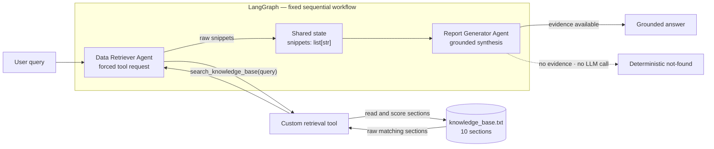

# Simple Agentic RAG

> An auditable two-agent RAG pipeline built with LangGraph and OpenAI.
> It retrieves raw evidence from a local knowledge base, hands that evidence
> between agents through typed shared state, and produces a grounded answer—or
> a deterministic not-found response when the knowledge base has no answer.


This repository is a deliberately small implementation of the
AI Engineer Programming Test. It focuses
on the assignment's core engineering concerns: clear agent responsibilities, a
custom Retrieval-Augmented Generation (RAG) tool, explicit orchestration,
inspectable evidence handoff, grounded generation, and reproducible offline
tests.

## What the system does

A user asks a question about the fictional **Siam Innovate** knowledge base.
The system then:

1. sends the question to a **Data Retriever Agent**;
2. forces that agent to request the custom `search_knowledge_base` tool;
3. retrieves relevant sections from `knowledge_base.txt`;
4. passes the raw sections to a **Report Generator Agent** through LangGraph
   state; and
5. produces a concise answer based only on those sections.

Both front ends — the CLI and the bundled web UI — display the query, retrieved
evidence, and final answer as separate stages, making the RAG handoff easy to
audit.

### Key properties

- **Two specialized agents:** retrieval and answer synthesis have separate
  responsibilities.
- **Custom local RAG tool:** retrieval reads a plain UTF-8 text file and needs
  no vector database.
- **Deterministic retrieval:** the same query and knowledge base produce the
  same ordered snippets.
- **Raw evidence handoff:** the Retriever does not summarize or rewrite the
  sections it returns.
- **Grounded generation:** the Generator is instructed to use only the
  retrieved evidence.
- **Explicit failure semantics:** a valid empty search returns an exact
  not-found sentence, while protocol, corpus, and model-output failures surface
  as errors.
- **Resilient CLI boundary:** one failed interactive query is reported safely
  without ending the session.
- **Inspectable web UI:** a dependency-free single-page front end renders the
  same five stages, keeping raw evidence visually separate from the synthesised
  answer.
- **Offline test suite:** retrieval and orchestration tests require neither an
  API key nor network access.

## Architecture



The graph topology has no router, retry loop, or conditional retrieval path:

```text
START -> data_retriever -> report_generator -> END
```

Agent-to-agent handoff uses one explicit state contract:

```python
class PipelineState(TypedDict):
    query: str            # original user question
    snippets: list[str]   # Retriever output -> Generator input
    report: str           # final answer
```

### Agent responsibilities

#### 1. Data Retriever Agent

- binds only the `search_knowledge_base` tool;
- uses `tool_choice="required"` so the model must request a tool call;
- validates that the model requested exactly one correctly named tool call;
- rejects any model-rewritten query and executes the original graph-state
  query as the source of truth;
- writes the tool's unmodified `list[str]` result to `state["snippets"]`; and
- never produces the user-facing answer.

#### 2. Report Generator Agent

- receives only the user query and retrieved snippets;
- has no tools;
- combines complementary facts and removes repetition;
- is instructed not to add outside knowledge or assumptions; and
- short-circuits empty evidence to:

```text
I could not find this information in the knowledge base.
```

## Retrieval design

`knowledge_base.txt` contains 10 clearly delimited sections across workplace
policies, international travel, expenses, a payment product, and customer
support. Each section begins with a machine-readable heading:

```text
--- Section Title ---
Section content...
```

The custom tool in `src/tools/retrieval.py` uses a transparent normalized
weighted lexical pipeline:

1. read `knowledge_base.txt` as UTF-8;
2. reject empty files, missing section headings, and sections without bodies;
3. split the document at section headings;
4. normalize reviewed phrase aliases such as `work from home` → `remote work`
   and `per diem` → `daily allowance`;
5. canonicalize explicit domain variants such as `remotely` → `remote` and
   `vacation` → `leave`, without unsafe suffix stripping;
6. remove query framing, English stopwords, and broad enterprise terms from
   query topic terms only;
7. calculate smoothed inverse document frequency (IDF) across the 10 sections;
8. score each distinct query term once, with title matches weighted `1.5` and
   body-only matches weighted `1.0`;
9. admit a candidate when it has a title anchor or at least two matched terms;
10. keep candidates scoring at least `60%` of the best score and at least
    `1.0`;
11. for a focused two-term topic, retain a lower-scoring sibling only when it
    shares a title anchor with a full-coverage candidate;
12. sort by descending score and then original document order; and
13. return every section that passes the relevance gate—there is no fixed
    `TOP_K`.

The constants are calibrated against the 23-case Golden Retrieval Dataset in
`tests/fixtures/retrieval_cases.json`. The gate achieves 100% exact-case pass,
section precision, section recall, and unknown-query rejection on that checked
dataset while remaining fully deterministic:

| Query | Retrieved sections |
|---|---|
| `international travel` | Approval Process, Daily Allowance, Insurance |
| `How many remote days are allowed?` | Remote Work |
| `overseas business trip per diem` | Daily Allowance |
| `annual vacation entitlements` | Annual Leave |
| `international card fee` | PaySiam Gateway only |
| `international travel insurance coverage` | Travel Insurance only |
| `international travel approval, allowance, and insurance requirements` | All three Travel sections |
| `escalate a P1 outage` | Support Escalation + Customer Support Levels |
| `Can I work remotely?` | Remote Work + Hybrid Work |
| `What is the CEO's salary?` | No sections |

The tool returns source sections as raw text. It does not ask an LLM to search,
summarize, enrich, or rank the evidence.

## Technology stack

| Component | Technology | Purpose |
|---|---|---|
| Runtime | Python 3.11 | Application and tests |
| Orchestration | LangGraph | Fixed two-node workflow and shared state |
| Agent/tool primitives | LangChain Core | Messages, tool schema, and invocation |
| LLM integration | LangChain OpenAI | `ChatOpenAI` client and tool binding |
| Configuration | python-dotenv | Local environment configuration |
| Knowledge store | UTF-8 text file | Small, inspectable evidence source |
| Web UI | HTML, CSS, vanilla JS | Dependency-free stage-by-stage demo front end |
| Testing | `unittest` | Offline regression and graph tests |

## Project structure

```text
.
├── main.py                       # CLI: single-query and interactive modes
├── knowledge_base.txt            # 10-section local knowledge base
├── requirements.txt              # pinned Python dependencies
├── .env.example                  # safe configuration template
├── AI Engineer Programming Test.md
├── LICENSE
├── README.md
├── screenshots/
│   ├── 01_international_travel.png       # CLI runs
│   ├── 02_remote_work.png
│   ├── 03_not_found.png
│   └── ui_01_empty.png … ui_07_dark.png  # web UI states
├── src/
│   ├── config.py                 # model, temperature, and KB path
│   ├── graph.py                  # PipelineState and LangGraph wiring
│   ├── agents/
│   │   ├── __init__.py           # shared ChatOpenAI construction
│   │   ├── retriever.py          # Data Retriever node
│   │   └── reporter.py           # Report Generator node
│   └── tools/
│       └── retrieval.py          # parsing, scoring, and custom tool
├── tests/
│   ├── fixtures/
│   │   └── retrieval_cases.json  # 23-case golden retrieval dataset
│   ├── test_retrieval.py         # retrieval precision/recall regressions
│   ├── test_graph.py             # agent behavior and graph handoff
│   ├── test_live_e2e.py          # opt-in real provider integration
│   └── test_main.py              # CLI rendering and failure recovery
└── web/                          # dependency-free single-page UI
    ├── index.html                # markup for the five pipeline stages
    ├── styles.css                # tokens, badges, light and dark themes
    ├── api.js                    # the only backend seam
    ├── mock-data.js              # offline fixtures for the demo
    ├── app.js                    # state and rendering
    └── README.md                 # run and backend-wiring guide
```

## Quick start

The project has been verified on **Python 3.11** and requires a Standard OpenAI
API key for end-to-end queries.

```bash
git clone https://github.com/Sayomphon/Simple_Agentic_RAG.git
cd Simple_Agentic_RAG

python3.11 -m venv .venv
source .venv/bin/activate
python -m pip install -r requirements.txt

cp .env.example .env
```

On Windows, activate the environment with:

```powershell
.venv\Scripts\activate
```

Add your API key to `.env`:

```dotenv
OPENAI_API_KEY=your_api_key_here
MODEL_NAME=gpt-5-mini
TEMPERATURE=0
KB_PATH=knowledge_base.txt
RUN_LIVE_LLM_TESTS=0
LIVE_LLM_TEST_MODEL=gpt-5-mini
```

| Variable | Required | Default | Description |
|---|---:|---|---|
| `OPENAI_API_KEY` | Yes | — | Standard OpenAI API credential |
| `MODEL_NAME` | No | `gpt-5-mini` | Chat model used by both agents |
| `TEMPERATURE` | No | `0` | Used for models that support a custom temperature |
| `KB_PATH` | No | `knowledge_base.txt` | Path to the local text knowledge base |
| `RUN_LIVE_LLM_TESTS` | No | `0` | Set to `1` only when explicitly running live provider tests |
| `LIVE_LLM_TEST_MODEL` | No | `gpt-5-mini` | Model used by the opt-in integration tests |

`.env` and virtual environments are ignored by Git. Never commit a real API
key.

## Run the application

### Single query

```bash
python main.py "What is the policy on international travel?"
```

### Interactive mode

```bash
python main.py
```

Enter an empty line, `exit`, `quit`, or press `Ctrl-C` to stop.

The CLI exposes all three observable stages:

```text
[1] USER QUERY
[2] RETRIEVED SNIPPETS (Data Retriever -> Report Generator)
[3] FINAL ANSWER
```

Suggested queries:

```text
What is the policy on international travel?
Can I work remotely?
What is the CEO's salary?
```

- The international-travel query retrieves three complementary sections.
- The remote-work query combines Remote Work and Hybrid Work.
- The CEO salary query retrieves nothing and returns the deterministic
  not-found sentence.

### Web interface

The repository also ships a single-page UI that renders the same workflow as five
sequential stages, keeping the raw retrieved evidence visually separate from the
synthesised answer.

```bash
open web/index.html
```

There is no build step, no `npm install`, and no dependencies. The page starts on
**bundled mock data** — fixtures copied verbatim from `knowledge_base.txt` — so
every state is demonstrable offline, including the not-found guardrail.


This repository contains no HTTP service, so live mode requires adding one.
`web/api.js` is the single seam: point `CONFIG.endpoint` at a `POST /api/query`
route that returns `PipelineState` as JSON, then switch the header pill to
**Live backend**. [`web/README.md`](web/README.md) contains the FastAPI snippet
and the full contract, including why an empty `snippets` array is a valid result
rather than an error.

## Tests

Run the complete default suite:

```bash
python -m unittest discover -v
```

The default run discovers **53 tests**: **51 pass offline** and the **2 live
tests are skipped**. It covers:

- knowledge-base loading and section splitting;
- phrase/token normalization and query-framing removal;
- deterministic IDF and weighted title/body scoring;
- the 23-case Golden Retrieval Dataset;
- exact-case pass rate, section precision/recall, and unknown rejection;
- focused, natural-language, multi-section, and unknown-query retrieval;
- stopword and generic-term false-positive protection;
- relative-to-best relevance gating;
- verbose multi-intent recall;
- cross-section recall;
- complete relevant-section retrieval and deterministic ordering;
- exact Retriever tool-call contract enforcement;
- malformed knowledge-base rejection;
- string and structured Report Generator output;
- raw-snippet handoff through LangGraph;
- exact two-node graph topology;
- deterministic not-found behavior without a Generator LLM call;
- CLI exception chaining, safe error rendering, exit status, and interactive
  recovery.

The suite uses mocks at the LLM boundary, so it needs no API key and makes no
network requests. The live tests remain skipped unless explicitly enabled.

### Opt-in live LLM integration

The live gate verifies authentication, model/tool-call compatibility, the
actual `ChatOpenAI.bind_tools()` response shape, raw corpus handoff, and the
real Retriever → Tool → Reporter path:

```bash
RUN_LIVE_LLM_TESTS=1 \
LIVE_LLM_TEST_MODEL=gpt-5-mini \
python -m unittest tests.test_live_e2e -v
```

`OPENAI_API_KEY` must be present in the environment or `.env`; otherwise the
opted-in class is skipped with a clear reason. The two tests use only fictional
knowledge-base questions and make approximately three provider calls:

| Test | Retriever LLM | Reporter LLM | Total |
|---|---:|---:|---:|
| Known international-travel query | 1 | 1 | 2 |
| Unknown CEO-salary query | 1 | 0 | 1 |

The known-query assertion checks structural contracts and verifies that every
returned snippet is byte-for-byte one of the loaded corpus sections. It does
not assert exact generative wording. The unknown path verifies the exact
deterministic not-found sentence.

For a submission or release check, run:

```bash
python -m compileall -q main.py src tests
python -m pip check
python -m unittest discover -v
git diff --check
```

Run the live command separately only with an approved project-scoped key,
provider usage limits, and controlled egress. Do not publish prompts, raw
responses, environment dumps, authorization headers, or credentials as CI
artifacts.

## Example results

### Command-line interface

The screenshots below were captured from successful live CLI runs with
`gpt-5-mini`. Each image shows the user query, the raw evidence handoff, and the
final grounded answer.

#### International travel — multi-section synthesis

The assignment's sample question retrieves Approval Process, Daily Allowance,
and Insurance sections before producing one cohesive answer.


#### Remote work — related-section synthesis

The system combines Remote Work Policy and Hybrid Work Guidelines without
duplicating overlapping information.


#### Knowledge-base gap — deterministic not-found

Executive salary information does not exist in the knowledge base, so the
system returns the fixed fallback instead of inventing an answer.


### Web interface

These screenshots come from the bundled UI running on **mock fixtures**, not a
live provider call. The retrieved sections are byte-identical to
`knowledge_base.txt`, and the mock gate returns the same sections as the Python
tool for the queries in the table above.

#### International travel — evidence handoff made visible

Step 2 shows the forced single tool call and confirms the query reached the tool
unchanged. Step 3 shows all three sections raw. Step 5 shows the synthesised
answer with its section citations.


#### Not-found guardrail

No section clears the relevance gate, so the evidence panel reports
*No evidence found* and the Report Generator returns the deterministic sentence
without an LLM call.


#### Loading state

Each stage reports its own status while the workflow runs, so the sequence
Retriever → Evidence → Generator → Answer stays visible in flight.


#### Backend failure

A failure is not converted into a not-found. The error is surfaced with the
unfinished stages marked *Failed*, matching the CLI's failure semantics.


#### Responsive and dark theme

The same five stages on a 390 px viewport and in the dark colour scheme.

| Mobile | Dark |
|---|---|
|  |  |

## Design decisions

**Why LangGraph.** The assignment evaluates orchestration, and LangGraph makes
the execution order and handoff contract inspectable. Each agent is a node,
each transition is an explicit edge, and `snippets` is a visible state field
rather than an implicit function-call detail.

**Why a forced retrieval tool call.** Binding the Retriever with
`tool_choice="required"` asks the model to use retrieval, while runtime
validation enforces exactly one correctly named call with the unchanged
original query. Only the custom tool reads the knowledge base; the Retriever's
model output is not treated as evidence.

**Why normalized weighted lexical retrieval.** For a 10-section assignment
corpus, reviewed phrase/token aliases plus IDF-weighted title/body matching are
easier to explain, audit, and test than an embedding index. The relative
relevance gate tolerates natural-language filler without letting a broad
one-term match overwhelm a focused section. The threshold and aliases are
versioned with the Golden Dataset instead of being tuned from one example.

**Why raw state handoff.** Keeping source sections unchanged makes it possible
to compare the Generator's input directly with `knowledge_base.txt`. This
separates retrieval quality from answer-generation quality.

**Why short-circuit empty evidence.** When `snippets` is empty, there is nothing
safe to synthesize. Returning a fixed sentence without an LLM call reduces
hallucination risk, latency, and API cost.

**Why failures are not converted to not-found.** A missing tool call, malformed
corpus, or empty model response means the pipeline failed; it does not prove
that the requested information is absent. These errors retain their original
cause internally, while the CLI emits a concise message without raw queries,
prompts, snippets, or credentials. Single-query mode exits non-zero, and
interactive mode continues with the next query.

**Why pinned dependencies.** Exact versions reduce installation drift in a
reviewer's Python 3.11 environment.

## Limitations and production next steps

This repository intentionally optimizes for clarity and assignment alignment,
not production scale.

- **Curated lexical semantics only:** reviewed aliases cover evaluated domain
  language, but unseen synonyms and conceptual similarity are not understood.
- **No general stemming:** explicit aliases avoid corrupting terms such as
  `business` and product names, but unlisted morphological variants can still
  miss.
- **English query terms:** effective retrieval requires specific English terms
  present in the knowledge base or its reviewed alias vocabulary.
- **Heuristic relevance gate:** the `1.5` title weight and `0.60` relative
  cutoff pass the current 23-case dataset but require recalibration against
  representative production traffic.
- **Small local corpus:** a linear scan is appropriate for 10 sections, not
  hundreds of thousands of documents.
- **Prompt-level grounding:** the Generator is strongly instructed to use only
  snippets, but production systems should also evaluate claims and citations.
- **No service layer:** the pipeline runs in-process behind the CLI. There is no
  HTTP API, authentication, persistence, monitoring, or rate-limit handling.
- **Mock-first web UI:** because no service exists yet, the front end ships with
  offline fixtures. They reproduce the retrieval gate's decisions for the
  evaluated queries but do not execute the Python tool, so the UI is a
  demonstration of the workflow rather than a second implementation of it.

A production evolution would add document ingestion and lifecycle management,
a larger labeled retrieval dataset, hybrid lexical/vector retrieval, metadata
filters and access control, answer faithfulness checks, tracing, cost and
latency monitoring, provider error handling, and a deployable API layer.

## License

This project is available under the [MIT License](LICENSE).
