# Simple Agentic RAG

> An auditable two-agent RAG pipeline built with LangGraph and OpenAI.
> It retrieves raw evidence from a local knowledge base, hands that evidence
> between agents through typed shared state, and produces a grounded answer—or
> a deterministic not-found response when the knowledge base has no answer.


This repository is a deliberately small implementation of the
AI Engineer Programming Test. It focuses
on the assignment's core engineering concerns: clear agent responsibilities, a
custom Retrieval-Augmented Generation (RAG) tool, explicit orchestration,
inspectable evidence handoff, grounded generation, and reproducible offline
tests.

## What the system does

A user asks a question about the fictional **Siam Innovate** knowledge base.
The system then:

1. sends the question to a **Data Retriever Agent**;
2. forces that agent to request the custom `search_knowledge_base` tool;
3. retrieves relevant sections from `knowledge_base.txt`;
4. passes the raw sections to a **Report Generator Agent** through LangGraph
   state; and
5. produces a concise answer based only on those sections.

Both front ends — the CLI and the bundled web UI — display the query, retrieved
evidence, and final answer as separate stages, making the RAG handoff easy to
audit.

### Key properties

- **Two specialized agents:** retrieval and answer synthesis have separate
  responsibilities.
- **Custom local RAG tool:** retrieval reads a plain UTF-8 text file and needs
  no vector database.
- **Measured retrieval modes:** offline lexical search is the deterministic
  default; opt-in semantic and hybrid modes use cached OpenAI embeddings
  behind the same tool contract.
- **Measured Thai path:** Thai questions over the English knowledge base use
  an English retrieval sub-query, while final answers remain Thai and
  citation titles remain byte-verifiable English.
- **Raw evidence handoff:** the Retriever does not summarize or rewrite the
  sections it returns; a mixed question may be split into up to three
  sub-queries, but the handoff always contains at least everything a single
  search over the original query returns.
- **Per-snippet observability:** CLI and web consumers can inspect each
  section's retrieval score, method, allowlisted diagnostic detail, and
  measured retrieval latency without adding that metadata to the Generator
  prompt.
- **Grounded generation:** the Generator is instructed to use only the
  retrieved evidence, snippets are passed inside a declared `<evidence>`
  data boundary, and every `[Section Title]` citation is validated at
  runtime against the sections actually handed off.
- **Explicit failure semantics:** a valid empty search returns an exact
  not-found sentence, while protocol, corpus, and model-output failures surface
  as errors.
- **Streaming CLI:** retrieved evidence prints as soon as retrieval
  finishes and answer tokens render as they arrive, while the final state
  report remains the source of truth.
- **Measured quality:** retrieval and answer quality are numbers produced
  by runners in this repository, reported for both a calibration set and a
  held-out set. Answer cases also have evaluation-only, claim-level
  faithfulness and relevance scores (see [Evaluation](#evaluation)).
- **Resilient CLI boundary:** one failed interactive query is reported safely
  without ending the session.
- **Inspectable web UI:** a dependency-free single-page front end renders the
  same five stages, keeping raw evidence visually separate from the synthesised
  answer.
- **Offline test suite:** retrieval and orchestration tests require neither an
  API key nor network access.

## Architecture

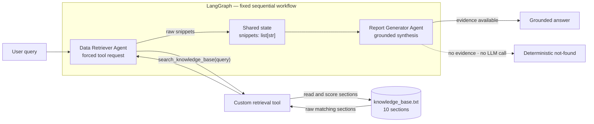

The graph topology has no router, retry loop, or conditional retrieval path:

```text
START -> data_retriever -> report_generator -> END
```

Agent-to-agent handoff uses three required fields. Retrieval diagnostics are
an optional UI-only field carried beside that handoff:

```python
class PipelineState(TypedDict):
    query: str
    snippets: list[str]   # only this raw evidence enters the Generator prompt
    report: str
    retrieval_telemetry: NotRequired[list[SearchTelemetry]]
```

`retrieval_telemetry` never changes the `search_knowledge_base` schema or its
`list[str]` output. The Retriever consumes it immediately after each tool call;
the Reporter continues to construct its prompt from `query` and `snippets`
only.

### Agent responsibilities

#### 1. Data Retriever Agent

- rejects empty, whitespace-only, and over-length (> 2,000 characters)
  queries before any LLM call;
- binds only the `search_knowledge_base` tool;
- uses `tool_choice="required"` so the model must request a tool call;
- validates the model's plan: between 1 and 3 correctly named tool calls,
  each with a non-empty string query — a single-topic English question stays
  one call with the original query, a non-English question uses a faithful
  English translation, and a mixed question may split into focused English
  sub-queries;
- executes every search itself: the original graph-state query always runs
  first as a deterministic baseline, then each sub-query's new sections are
  appended in call order with exact-text deduplication — so the handoff is
  provably a superset of `search(original_query)` no matter how the model
  decomposes;
- writes that raw `list[str]` to `state["snippets"]`; and
- never produces the user-facing answer.

#### 2. Report Generator Agent

- receives only the user query and retrieved snippets;
- has no tools;
- reads snippets inside an `<evidence>` block its prompt declares to be
  data, never instructions (knowledge-base text is untrusted);
- combines complementary facts and removes repetition;
- is instructed not to add outside knowledge or assumptions;
- answers in the user's language while preserving evidence numbers, currency
  codes, names, product/system names, and English citation titles verbatim;
- answers the supported parts of a mixed question and states plainly which
  part the knowledge base does not cover;
- has every `[Section Title]` citation checked in code against the
  handed-off snippets — an invented citation raises an error instead of
  shipping a fabricated source; and
- short-circuits empty evidence to:

```text
I could not find this information in the knowledge base.
```

## Retrieval design

`knowledge_base.txt` contains 10 clearly delimited sections across workplace
policies, international travel, expenses, a payment product, and customer
support. Each section begins with a machine-readable heading:

```text
--- Section Title ---
Section content...
```

`src/tools/retrieval.py` is a thin, stable agent-facing wrapper. It always
accepts `query: str` and returns raw `list[str]`, while a factory selects one
of three internal strategies from `SEARCH_MODE`:

| mode | implementation | network |
|---|---|---|
| `lexical` (default) | normalized weighted lexical scoring | offline |
| `semantic` | `text-embedding-3-small` + cosine + calibrated threshold | OpenAI API |
| `hybrid` | independently gated lexical/semantic results + RRF (`k=60`) | OpenAI API |

The Data Retriever Agent cannot select or change this mode. That keeps
latency, cost, and evaluation reproducible. The lexical implementation in
`src/retrievers/lexical.py` uses this transparent pipeline:

1. read `knowledge_base.txt` as UTF-8 (parsed sections are cached per file
   identity — path, `mtime_ns`, size — so an edited file invalidates
   naturally);
2. reject empty files, missing section headings, and sections without bodies;
3. split the document at section headings;
4. normalize reviewed phrase aliases such as `work from home` → `remote work`
   and `per diem` → `daily allowance`;
5. canonicalize reviewed derivational variants and synonyms such as
   `lodging` → `hotel`, `reimbursing` → `reimbursement`, and
   `vacation` → `leave`;
6. remove query framing, English stopwords, and broad enterprise terms from
   query topic terms only;
7. apply a light inflectional stemmer (`-s`/`-es`/`-ies`/`-ed`/`-ing` plus
   final-e elision, run to an idempotent fixpoint) to both query and section
   terms — after aliases, so reviewed mappings always win;
8. calculate smoothed inverse document frequency (IDF) across the 10 sections;
9. score each distinct query term once, with title matches weighted `1.5` and
   body-only matches weighted `1.0`;
10. admit a candidate when it has a title anchor or at least two matched terms;
11. keep candidates scoring at least `60%` of the best score and at least
    `1.0`;
12. for a focused two-term topic, retain a lower-scoring sibling only when it
    shares a title anchor with a full-coverage candidate;
13. sort by descending score and then original document order; and
14. return every section that passes the relevance gate—there is no fixed
    `TOP_K`.

The lexical constants are calibrated against the 27-case **calibration set** in
`tests/fixtures/retrieval_cases.json` — the numbers on that set are a fit
statistic, not a generalization estimate. The gate achieves 100% exact-case
tuning set while remaining fully deterministic; generalization is measured
separately on a held-out set (see [Evaluation](#evaluation)):

| Query | Retrieved sections |
|---|---|
| `international travel` | Approval Process, Daily Allowance, Insurance |
| `How many remote days are allowed?` | Remote Work |
| `overseas business trip per diem` | Daily Allowance |
| `annual vacation entitlements` | Annual Leave |
| `international card fee` | PaySiam Gateway only |
| `international travel insurance coverage` | Travel Insurance only |
| `international travel approval, allowance, and insurance requirements` | All three Travel sections |
| `escalate a P1 outage` | Support Escalation + Customer Support Levels |
| `Can I work remotely?` | Remote Work + Hybrid Work |
| `What is the CEO's salary?` | No sections |

Semantic mode embeds the 10 raw sections in one batch, stores only numeric
vectors in `.cache/embeddings/`, and invalidates that cache when either the
embedding model or byte-relevant chunk content changes. Cache files are JSON
(never executable pickle), atomically replaced, permission-restricted, size
bounded, and validated for count, dimension, finite values, and non-zero
norms. Every query makes one embedding request and performs an in-memory
linear cosine scan; there is no vector database, ANN index, reranker, query
rewrite, or silent fallback.

`MIN_COSINE=0.392817` comes from the measured precision-weighted F0.5 sweep in
[threshold_calibration.md](threshold_calibration.md). The positive and
hard-negative distributions overlap, so no global threshold can provide both
zero false positives and useful recall: the selected boundary yields 87.5%
pair precision and 92.1% pair recall on the calibration pairs. The zero-FP
boundary would reject all 38 measured positive pairs and is therefore
reported, not deployed.

Hybrid mode gates each side before fusion, uses rank-only Reciprocal Rank
Fusion because lexical and cosine scores have incompatible scales, and
deduplicates exact raw chunks. It is recall-oriented: measured held-out recall
is 100%, but it inherits lexical false positives.

The tool returns source sections as raw text. It never asks an LLM to search,
summarize, enrich, rerank, or rewrite the evidence.

## Technology stack

| Component | Technology | Purpose |
|---|---|---|
| Runtime | Python 3.11 | Application and tests |
| Orchestration | LangGraph | Fixed two-node workflow and shared state |
| Agent/tool primitives | LangChain Core | Messages, tool schema, and invocation |
| OpenAI integration | LangChain OpenAI | `ChatOpenAI` agents and `OpenAIEmbeddings` semantic mode |
| Configuration | python-dotenv | Local environment configuration |
| Knowledge store | UTF-8 text file | Small, inspectable evidence source |
| Web UI | HTML, CSS, vanilla JS | Dependency-free stage-by-stage demo front end |
| Testing | `unittest` | Offline regression and graph tests |

## Project structure

```text
.
├── main.py                       # CLI: single-query and interactive modes
├── knowledge_base.txt            # 10-section local knowledge base
├── requirements.txt              # pinned Python dependencies
├── .env.example                  # safe configuration template
├── LICENSE
├── README.md
├── screenshots/
│   ├── 01_international_travel.png       # CLI runs
│   ├── 02_remote_work.png
│   ├── 03_not_found.png
│   └── ui_01_empty.png … ui_07_dark.png  # web UI states
├── docs/
│   └── DESIGN_NOTES.md           # engineering rationale and trade-offs
├── evaluation_results.md         # generated multi-mode retrieval metrics
├── threshold_calibration.md      # cosine-threshold provenance and trade-offs
├── answer_eval_results.md        # generated by the opt-in live answer eval
├── src/
│   ├── config.py                 # models, retrieval mode, thresholds, paths
│   ├── graph.py                  # PipelineState and LangGraph wiring
│   ├── agents/
│   │   ├── __init__.py           # per-model ChatOpenAI construction
│   │   ├── retriever.py          # Data Retriever node
│   │   └── reporter.py           # Report Generator node
│   ├── evaluation/
│   │   ├── calibrate_threshold.py # semantic threshold measurement
│   │   ├── dataset.py            # shared fixture loader
│   │   ├── metrics.py            # pure set-based retrieval metrics
│   │   ├── ablation.py           # V0..V5 scoring-layer ladder
│   │   ├── judges.py             # structured faithfulness/relevance judges
│   │   ├── judge_reporting.py    # pure judged-metric Markdown rendering
│   │   ├── run_retrieval_eval.py # lexical + semantic + hybrid evaluation
│   │   └── run_answer_eval.py    # opt-in live answer eval runner
│   ├── retrievers/
│   │   ├── base.py               # Retriever, scored result, telemetry contracts
│   │   ├── lexical.py            # measured offline implementation
│   │   ├── semantic.py           # embeddings, cosine, validated disk cache
│   │   ├── hybrid.py             # gate-first reciprocal-rank fusion
│   │   └── factory.py            # lazy configuration-owned strategy factory
│   └── tools/
│       └── retrieval.py          # thin custom tool + compatibility exports
├── tests/
│   ├── fixtures/
│   │   ├── retrieval_cases.json    # 27-case calibration set (tuning set)
│   │   ├── retrieval_heldout.json  # 14-case held-out set (never tuned on)
│   │   ├── retrieval_negatives.json # 12 intentional hard negatives
│   │   ├── retrieval_thai.json     # 13-case held-out Thai slice
│   │   └── answer_cases.json       # answer-quality facts and citations
│   ├── test_assignment_invariants.py # assignment architecture guards
│   ├── test_retrievers.py        # semantic, hybrid, cache, and factory tests
│   ├── test_retrieval.py         # retrieval, stemming, and cache tests
│   ├── test_evaluation.py        # dataset loader and metric tests
│   ├── test_answer_judge.py      # offline judge schema/retry/error tests
│   ├── test_graph.py             # agent behavior and graph handoff
│   ├── test_live_e2e.py          # opt-in real provider integration
│   ├── test_telemetry.py         # score/provenance/latency isolation tests
│   └── test_main.py              # CLI streaming and failure recovery
└── web/                          # dependency-free single-page UI
    ├── index.html                # markup for the five pipeline stages
    ├── styles.css                # tokens, badges, light and dark themes
    ├── api.js                    # the only backend seam
    ├── mock-data.js              # offline fixtures for the demo
    ├── app.js                    # state and rendering
    └── README.md                 # run and backend-wiring guide
```

## Quick start

The project has been verified on **Python 3.11** and requires a Standard OpenAI
API key for end-to-end queries.

```bash
git clone https://github.com/Sayomphon/Simple_Agentic_RAG.git
cd Simple_Agentic_RAG

python3.11 -m venv .venv
source .venv/bin/activate
python -m pip install -r requirements.txt

cp .env.example .env
```

On Windows, activate the environment with:

```powershell
.venv\Scripts\activate
```

Add your API key to `.env`:

```dotenv
OPENAI_API_KEY=your_api_key_here
MODEL_NAME=gpt-5-mini
TEMPERATURE=0
KB_PATH=knowledge_base.txt
SEARCH_MODE=lexical
EMBEDDING_MODEL_NAME=text-embedding-3-small
MIN_COSINE=0.392817
RRF_K=60
EMBED_CACHE_DIR=.cache/embeddings
LLM_TIMEOUT_SECONDS=30
LLM_MAX_RETRIES=2
RUN_LIVE_LLM_TESTS=0
LIVE_LLM_TEST_MODEL=gpt-5-mini
JUDGE_MODEL_NAME=gpt-5-mini
```

| Variable | Required | Default | Description |
|---|---:|---|---|
| `OPENAI_API_KEY` | Yes | — | Standard OpenAI API credential |
| `MODEL_NAME` | No | `gpt-5-mini` | Chat model used by both agents |
| `RETRIEVER_MODEL_NAME` | No | `MODEL_NAME` | Optional override for the Data Retriever only |
| `REPORTER_MODEL_NAME` | No | `MODEL_NAME` | Optional override for the Report Generator only |
| `JUDGE_MODEL_NAME` | No | `MODEL_NAME` | Evaluation-only model for faithfulness and relevance; never added to the runtime graph |
| `TEMPERATURE` | No | `0` | Used for models that support a custom temperature |
| `LLM_TIMEOUT_SECONDS` | No | `30` | Per-request provider timeout so the CLI cannot hang |
| `LLM_MAX_RETRIES` | No | `2` | Bounded retry budget for transient provider errors |
| `KB_PATH` | No | `knowledge_base.txt` | Path to the knowledge base; a relative value is anchored to the project root |
| `SEARCH_MODE` | No | `lexical` | `lexical`, `semantic`, or `hybrid`; configuration-owned, never chosen by the LLM |
| `EMBEDDING_MODEL_NAME` | No | `text-embedding-3-small` | Embedding model for semantic and hybrid modes |
| `MIN_COSINE` | No | `0.392817` | Measured semantic gate; see `threshold_calibration.md` before changing |
| `RRF_K` | No | `60` | Rank-fusion constant used only by hybrid mode |
| `EMBED_CACHE_DIR` | No | `.cache/embeddings` | Ignored local cache for validated document vectors |
| `RUN_LIVE_LLM_TESTS` | No | `0` | Set to `1` only when explicitly running live provider tests |
| `LIVE_LLM_TEST_MODEL` | No | `gpt-5-mini` | Model used by the opt-in integration tests |

`.env` and virtual environments are ignored by Git. Never commit a real API
key.

## Run the application

### Single query

```bash
python main.py "What is the policy on international travel?"
```

### Interactive mode

```bash
python main.py
```

Enter an empty line, `exit`, `quit`, or press `Ctrl-C` to stop.

The CLI exposes all three observable stages and streams them: the snippet
block prints as soon as retrieval finishes, with rank, score, retrieval
method, attempt count, and measured retrieval latency. Answer tokens render
as they arrive, and the final text on screen is always byte-equal with the
pipeline's report state:

```text
[1] USER QUERY
[2] RETRIEVED SNIPPETS (Data Retriever -> Report Generator)
[3] FINAL ANSWER
```

Suggested queries:

```text
What is the policy on international travel?
Can I work remotely?
What is the CEO's salary?
นโยบายการเดินทางต่างประเทศคืออะไร
```

- The international-travel query retrieves three complementary sections.
- The remote-work query combines Remote Work and Hybrid Work.
- The CEO salary query retrieves nothing and returns the deterministic
  not-found sentence.

### Web interface

The repository also ships a single-page UI that renders the same workflow as
five sequential stages. Each evidence card keeps the raw section separate from
the synthesised answer while showing its `lexical`, `semantic`, or `both`
provenance badge and score. Retriever metadata shows the configured mode,
attempt count, empty-attempt reason, and total retrieval latency.

```bash
open web/index.html
```

There is no build step, no `npm install`, and no dependencies. The page starts on
**bundled mock data** — fixtures copied verbatim from `knowledge_base.txt` — so
every state is demonstrable offline, including the not-found guardrail.

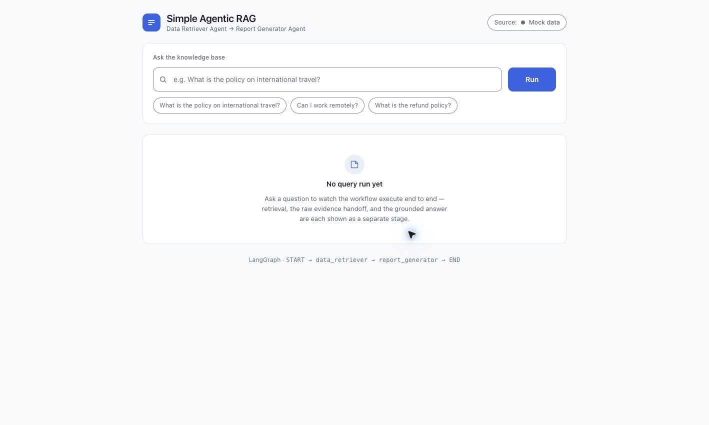

This repository contains no HTTP service, so live mode requires adding one.
`web/api.js` is the single seam: point `CONFIG.endpoint` at a `POST /api/query`
route that returns `PipelineState` as JSON, including optional
`retrieval_telemetry`, then switch the header pill to **Live backend**.
[`web/README.md`](web/README.md) contains the FastAPI snippet and the full
contract, including why an empty `snippets` array is a valid result rather than
an error.

## Tests

Run the complete default suite:

```bash
python -m unittest discover -v
```

The default run discovers **152 tests**: **147 pass offline** and the **5 live
tests are skipped**. It covers:

- knowledge-base loading, section splitting, and parse-cache invalidation;
- phrase/token normalization, query-framing removal, and the inflectional
  stemmer (table-driven cases, corpus-wide idempotency, stopword-collision
  guard);
- deterministic IDF and weighted title/body scoring;
- the 27-case calibration set (exact pass, precision/recall, unknown
  rejection) via the shared evaluation metrics;
- dataset-loader schema validation and hand-computed metric tests;
- the ablation ladder's equivalence with production settings;
- exact two-agent/sequential-graph assignment invariants and the unchanged
  `query: str -> list[str]` tool contract;
- per-mode telemetry population, thread isolation, consume-on-read behavior,
  empty-reason diagnostics, optional graph state, and Reporter prompt
  isolation;
- semantic cosine validation, threshold gating, byte-exact raw chunk mapping,
  missing-credential failure semantics, and document-cache reuse,
  invalidation, corruption recovery, and file permissions;
- hybrid gate-first RRF behavior, one-sided results, and exact deduplication;
- lazy per-mode factory caching and unsupported-mode rejection;
- hard-negative dataset validation and deterministic threshold-selection
  tests for both clean-gap and overlapping distributions;
- Retriever tool-call contract enforcement (1–3 calls, tool name,
  non-empty sub-queries) and the baseline-union superset guarantee;
- query validation (empty / whitespace / over-length) with no LLM call;
- per-role LLM construction, timeout, and retry wiring;
- strict structured-output judge schemas, application validation, bounded
  parse retry, input limits, prompt-injection boundaries, and safe independent
  `judge_error` handling;
- citation validation, evidence-block wrapping, and injection-guard prompt
  structure;
- malformed knowledge-base rejection;
- string and structured Report Generator output;
- raw-snippet handoff through LangGraph and exact two-node topology;
- deterministic not-found behavior without a Generator LLM call;
- CLI streaming (screen text byte-equal with the state report), exception
  chaining, safe error rendering, exit status, and interactive recovery.

The suite uses mocks at the LLM boundary, so it needs no API key and makes no
network requests. The live tests remain skipped unless explicitly enabled.

Run every production mode when an API key is available:

```bash
python -m src.evaluation.run_retrieval_eval
```

Force the offline lexical-only evaluation (also usable as a CI gate — it
exits non-zero if the current lexical variant misses its calibration
thresholds):

```bash
OPENAI_API_KEY= python -m src.evaluation.run_retrieval_eval
```

Recalibrate the semantic threshold only after intentionally changing the
embedding model, knowledge base, or labeled calibration sets:

```bash
python -m src.evaluation.calibrate_threshold
```

Both API-backed commands send the fictional knowledge-base sections and
evaluation queries to the configured embedding provider. Use them only with
approved data egress and a project-scoped key.

### Opt-in live LLM integration

The live gate verifies authentication, model/tool-call compatibility, the
actual `ChatOpenAI.bind_tools()` response shape, raw corpus handoff, and the
real Retriever → Tool → Reporter path:

```bash
RUN_LIVE_LLM_TESTS=1 \
LIVE_LLM_TEST_MODEL=gpt-5-mini \
python -m unittest tests.test_live_e2e -v
```

`OPENAI_API_KEY` must be present in the environment or `.env`; otherwise the
opted-in class is skipped with a clear reason. The five tests use only
fictional knowledge-base questions and make approximately nine provider
calls:

| Test | Retriever LLM | Reporter LLM | Total |
|---|---:|---:|---:|
| Known international-travel query | 1 | 1 | 2 |
| Unknown CEO-salary query | 1 | 0 | 1 |
| Thai cross-language query | 1 | 1 | 2 |
| Multi-intent baseline-coverage query | 1 | 1 | 2 |
| Streamed CLI byte-equality query | 1 | 1 | 2 |

The known-query assertion checks structural contracts and verifies that every
returned snippet is byte-for-byte one of the loaded corpus sections. It does
not assert exact generative wording. The unknown path verifies the exact
deterministic not-found sentence, the multi-intent case asserts the handoff
is a superset of the deterministic baseline search, and the CLI case asserts
the streamed screen text ends byte-equal with the state report.

For a submission or release check, run:

```bash
python -m compileall -q main.py src tests
python -m pip check
python -m unittest discover -v
python -m src.evaluation.run_retrieval_eval
git diff --check
```

Run the live command separately only with an approved project-scoped key,
provider usage limits, and controlled egress. Do not publish prompts, raw
responses, environment dumps, authorization headers, or credentials as CI
artifacts.

## Evaluation

Retrieval and answer quality are measured by code in this repository, not by
hand-checked examples. Lexical metrics are deterministic; hosted embeddings
can show small floating-point variation between live runs:

```bash
python -m src.evaluation.run_retrieval_eval          # all available modes
OPENAI_API_KEY= python -m src.evaluation.run_retrieval_eval  # lexical only
RUN_LIVE_LLM_TESTS=1 python -m src.evaluation.run_answer_eval
```

### Datasets

Four labeled retrieval sets plus one answer-quality set, all in
`tests/fixtures/`:

| Set | n | Purpose |
|---|---|---|
| calibration | 27 | The set every scoring constant was tuned against (including the stemmer rules and the added `morphology` cases). Numbers here are a fit statistic, not a generalization estimate. |
| held-out | 14 | Written from `knowledge_base.txt` alone after the retrieval implementation was frozen, committed before the evaluator ever ran against it, and never edited to flatter a result. |
| hard negatives | 12 | Intentional near-misses used to calibrate semantic threshold discipline. This is a calibration set, not held-out evidence. |
| Thai held-out | 13 | Ten natural Thai questions answerable from the English knowledge base plus three Thai negatives, frozen before its first retrieval run and never used to tune thresholds or labels. |
| answer cases | 16 | Required/forbidden facts and allowed citations per query, including three Thai answerable cases and one Thai negative. |

Because the retriever returns a threshold-gated set rather than a fixed-size
ranking (there is no `TOP_K`), retrieval is scored with set-based metrics.
`@k` metrics are deliberately not reported — the system has no `k`. Negative
queries are excluded from precision/recall/MRR and scored only by the
false-positive rate.

### Retrieval results

| set | mode | exact | P_macro | R_macro | F1 | MRR | FP_neg |
|---|---|---:|---:|---:|---:|---:|---:|
| calibration (27) | lexical | 100.0% | 100.0% | 100.0% | 1.000 | 1.000 | 0.0% |
| calibration (27) | semantic | 51.9% | 79.2% | 89.6% | 0.841 | 0.917 | 33.3% |
| calibration (27) | hybrid | 70.4% | 87.5% | 100.0% | 0.933 | 1.000 | 33.3% |
| held-out (14) | lexical | 57.1% | 77.3% | 72.7% | 0.749 | 0.818 | 66.7% |
| held-out (14) | semantic | 42.9% | 72.7% | 90.9% | 0.808 | 0.909 | 33.3% |
| held-out (14) | hybrid | 42.9% | 75.8% | 100.0% | 0.862 | 0.955 | 66.7% |
| hard negatives (12) | lexical | 8.3% | n/a | n/a | n/a | n/a | 91.7% |
| hard negatives (12) | semantic | 58.3% | n/a | n/a | n/a | n/a | 41.7% |
| hard negatives (12) | hybrid | 8.3% | n/a | n/a | n/a | n/a | 91.7% |
| Thai held-out (13) | lexical | 23.1% | 10.0% | 10.0% | 0.100 | 0.100 | 33.3% |
| Thai held-out (13) | semantic | 30.8% | 10.0% | 10.0% | 0.100 | 0.100 | 0.0% |
| Thai held-out (13) | hybrid | 30.8% | 20.0% | 20.0% | 0.200 | 0.200 | 33.3% |

These modes optimize different outcomes. Lexical remains the strongest exact
fit on its calibration set and the only offline path. Semantic raises held-out
recall from 72.7% to 90.9% and halves held-out negative FP from 66.7% to
33.3%, but over-retrieves related sections and therefore has lower exact
match. Hybrid reaches 100% held-out recall but inherits lexical false
positives because RRF can reorder admitted candidates, not remove a candidate
that already passed either source gate.

The Thai table measures each raw retrieval strategy directly, without the
Data Retriever Agent's translation sub-query. Direct cross-language retrieval
is weak at the existing threshold: semantic admits one of ten answerable
questions and hybrid admits two, while semantic rejects all three negatives.
The representative query `นโยบายการเดินทางต่างประเทศคืออะไร` returned `[]`
in all three raw modes. In a separately verified full-pipeline run, however,
the existing Retriever Agent translated that query into English, recovered
all three international-travel sections through the default lexical mode, and
the Reporter answered in Thai with verbatim English citations. This is a
measured best-effort agent path, not a claim that direct multilingual retrieval
is broadly solved.

Lexical retrieval stays below a millisecond. In the recorded live run,
semantic/hybrid query embedding p50 was roughly 370–580 ms depending on
mode and dataset; cache state and provider conditions affect latency and
document-embedding call counts.

### What each design decision buys

The pipeline is scored with each layer removed, on the held-out set:

| variant | exact_match | precision_macro | recall_macro | FP_rate (neg) |
|---|---|---|---|---|
| V0 raw token overlap | 21.4% | 43.1% | 90.9% | 100.0% |
| V1 + query-term filtering | 28.6% | 54.7% | 90.9% | 100.0% |
| V2 + phrase/token aliases | 35.7% | 63.8% | 100.0% | 100.0% |
| V3 + IDF and title weighting | 35.7% | 63.8% | 100.0% | 100.0% |
| V4 + relevance gate and sibling expansion | 50.0% | 60.6% | 63.6% | 66.7% |
| V5 current (+ light inflectional stemming) | 57.1% | 77.3% | 72.7% | 66.7% |

BM25-style term-frequency saturation was implemented and measured as a
seventh rung: at the largest constant that keeps calibration at 100% it
matched V5 on every metric, so it was dropped from the default
configuration. The measurement and reasoning are recorded in
[docs/DESIGN_NOTES.md](docs/DESIGN_NOTES.md).

### Answer-level results

The live runner keeps the eight deterministic axes as release gates and adds
two evaluation-only soft metrics. The judged axes use strict JSON Schema
outputs, application validation, bounded parse retry, and independent
`judge_error` reporting. The run below used `gpt-5-mini` for both agents and
the single judge, judge prompt `phase4-v1`, prompt commit `68d0837`, and one
run per case over all 57 labeled queries.

| axis | method | result | threshold |
|---|---|---|---|
| citation validity (runtime-enforced) | deterministic | 100.0% (57/57) | 100% |
| not-found discipline | deterministic | 100.0% (10/10) | 100% |
| evidence provenance | deterministic | 100.0% (57/57) | 100% |
| no LLM call on empty retrieval | deterministic | 100.0% (7/7) | 100% |
| baseline coverage | deterministic | 100.0% (57/57) | 100% |
| required-fact coverage | deterministic | 100.0% (18/18) | 100% |
| unsupported-number rate | deterministic | 0.0% (0/26) | 0% |
| forbidden-fact violations | deterministic | 0 | 0 |
| faithfulness | single LLM judge, claim-level | 1.000 (43/43 claims; 16 cases; errors: 0) | ≥ 0.900 (soft) |
| answer relevance | single LLM judge, 1–5 | 5.00/5.00 (16 cases; errors: 0) | ≥ 4.00 (soft) |

Full per-variant tables, per-case mismatches, and run metadata are in
[evaluation_results.md](evaluation_results.md) and
[answer_eval_results.md](answer_eval_results.md).

**Evaluation limitations:** all retrieval sets are small (n = 27, 14, 12, and
13) over a 10-section corpus, so a single case moves a percentage by several
points. The English and Thai held-out sets are written by the same author as
the knowledge base. Hard negatives are used for calibration and must not be
presented as generalization evidence. Hosted embedding scores can vary
slightly between live runs. The Thai translation sub-query and answer metrics
come from one run per case of a probabilistic model. The judged axes use the
same single model for one run with no ensemble or human calibration, so they
inherit its strictness and must not be treated as deterministic CI gates.

## Example results

### Command-line interface

The screenshots below were captured from successful live CLI runs with
`gpt-5-mini`. Each image shows the user query, the raw evidence handoff, and the
final grounded answer.

#### International travel — multi-section synthesis

The assignment's sample question retrieves Approval Process, Daily Allowance,
and Insurance sections before producing one cohesive answer.

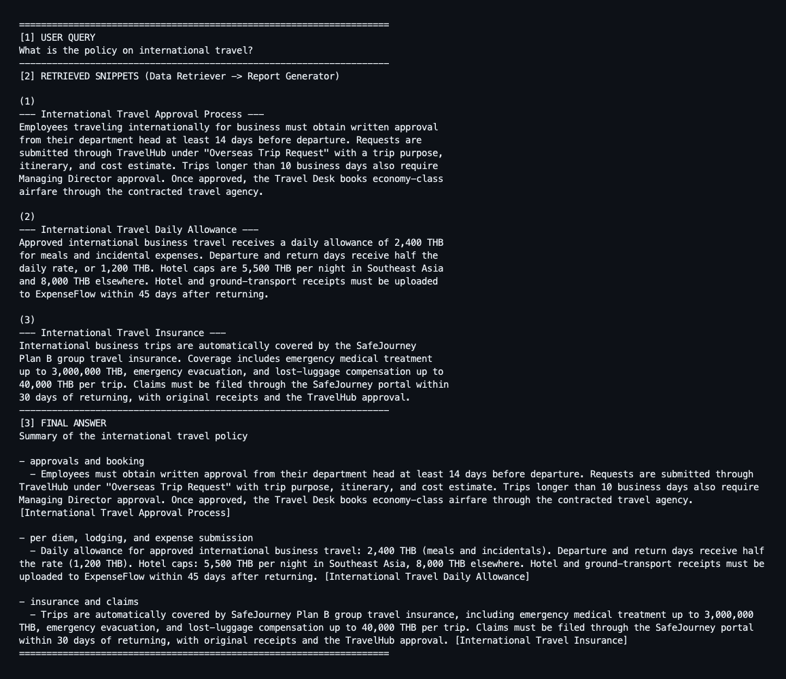

#### Remote work — related-section synthesis

The system combines Remote Work Policy and Hybrid Work Guidelines without
duplicating overlapping information.

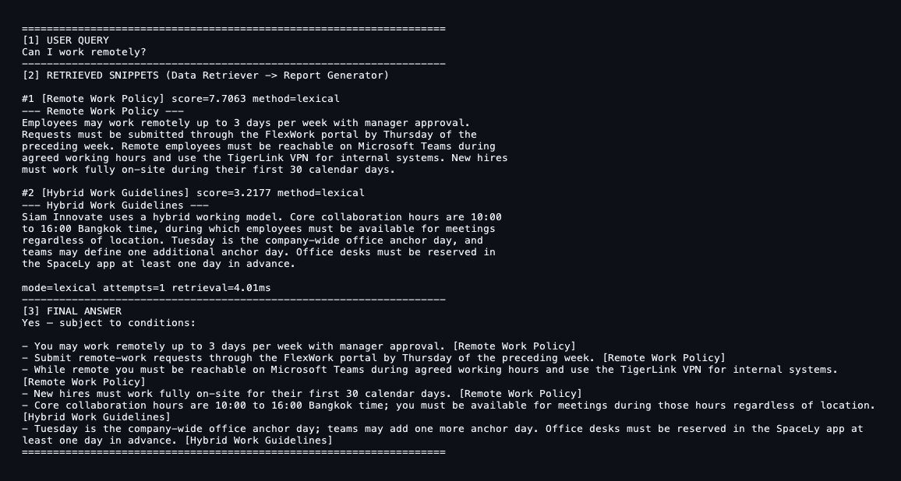

#### Knowledge-base gap — deterministic not-found

Executive salary information does not exist in the knowledge base, so the
system returns the fixed fallback instead of inventing an answer.

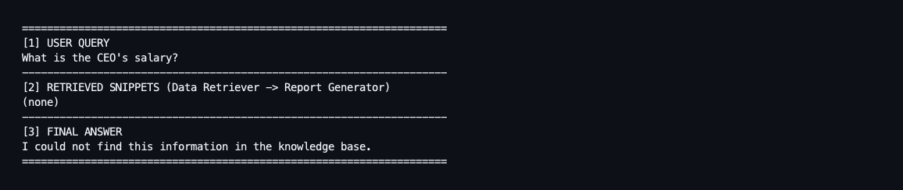

### Web interface

These screenshots come from the bundled UI running on **mock fixtures**, not a
live provider call. The retrieved sections are byte-identical to
`knowledge_base.txt`, and the mock gate returns the same sections as the Python
tool for the queries in the table above.

#### International travel — evidence handoff made visible

Step 2 shows the forced single tool call and confirms the query reached the tool
unchanged. Step 3 shows all three sections raw. Step 5 shows the synthesised
answer with its section citations.

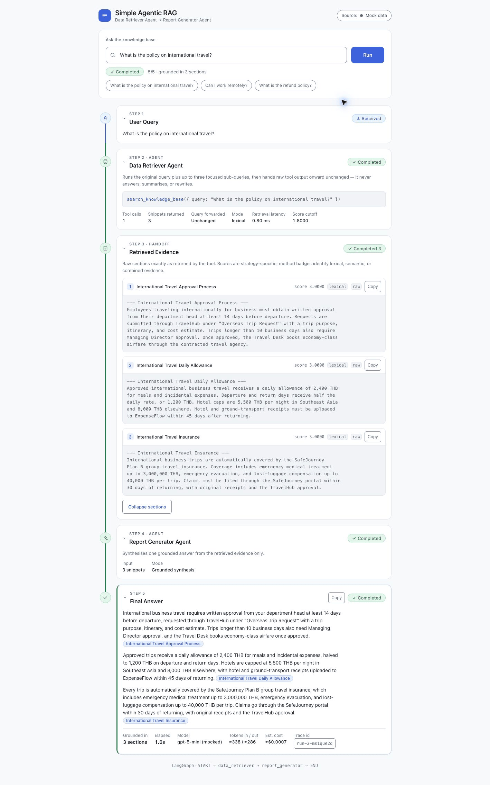

#### Not-found guardrail

No section clears the relevance gate, so the evidence panel reports
*No evidence found* and the Report Generator returns the deterministic sentence
without an LLM call.

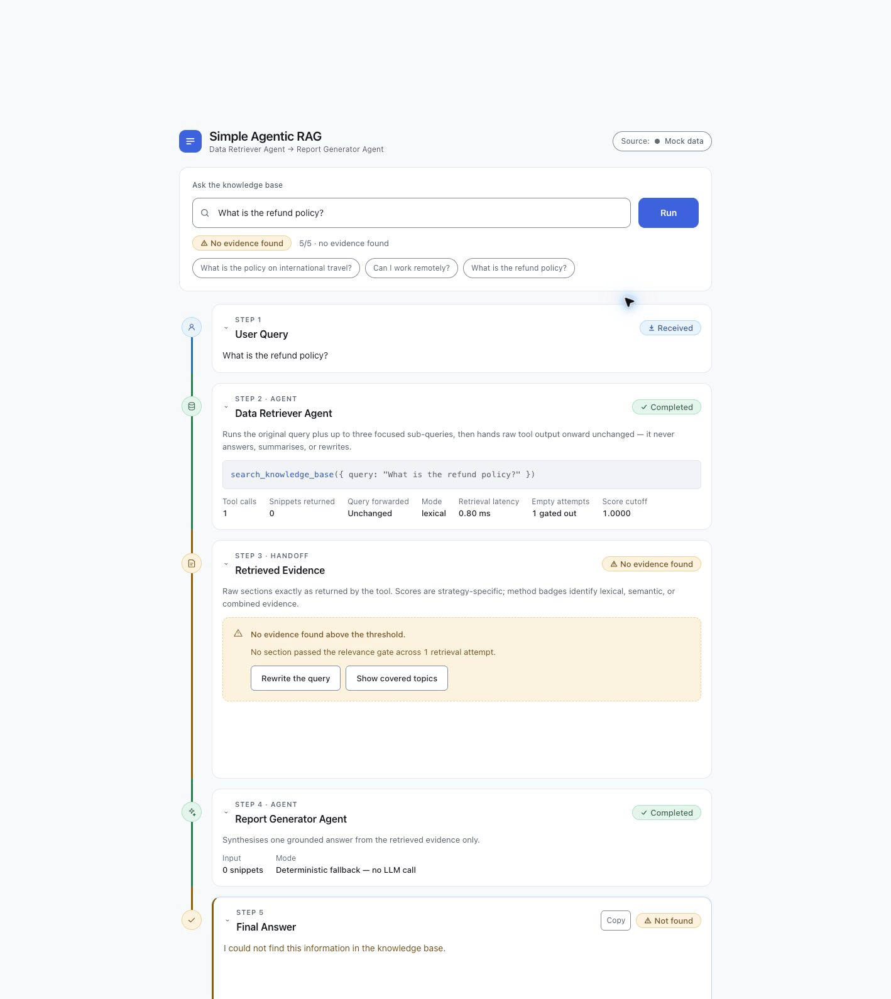

#### Loading state

Each stage reports its own status while the workflow runs, so the sequence
Retriever → Evidence → Generator → Answer stays visible in flight.

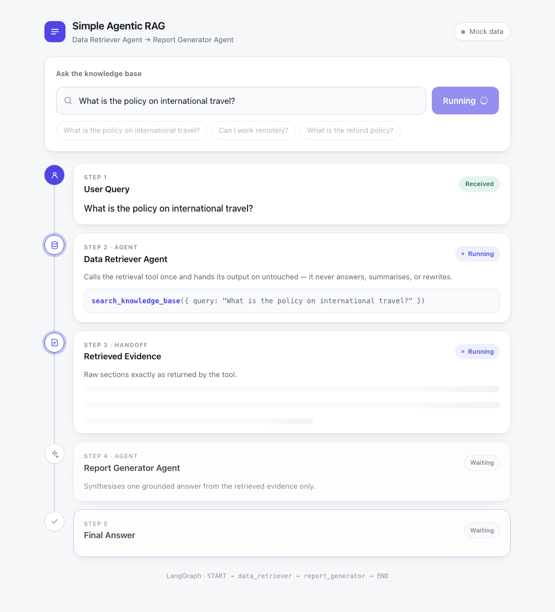

#### Backend failure

A failure is not converted into a not-found. The error is surfaced with the
unfinished stages marked *Failed*, matching the CLI's failure semantics.

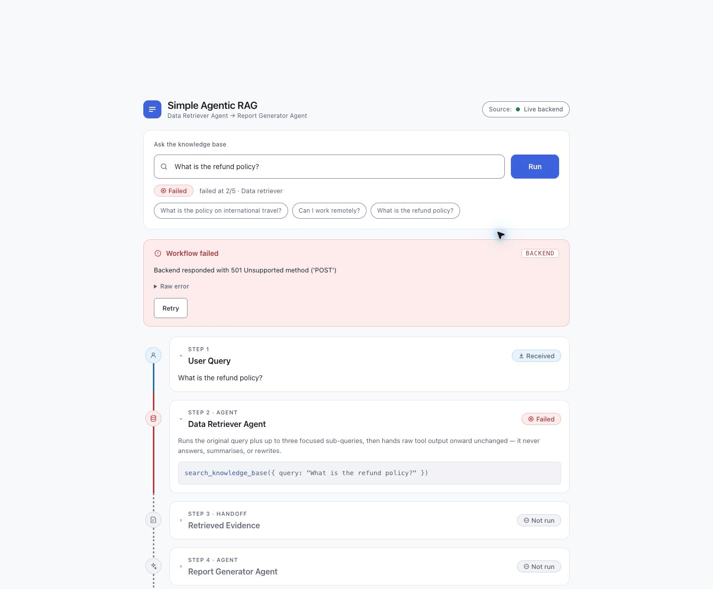

#### Responsive and dark theme

The same five stages on a 390 px viewport and in the dark colour scheme.

| Mobile | Dark |
|---|---|
| 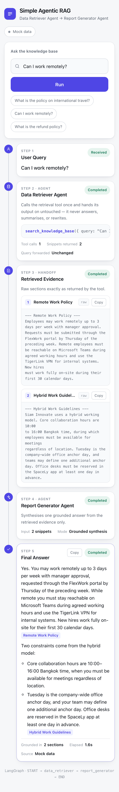 | 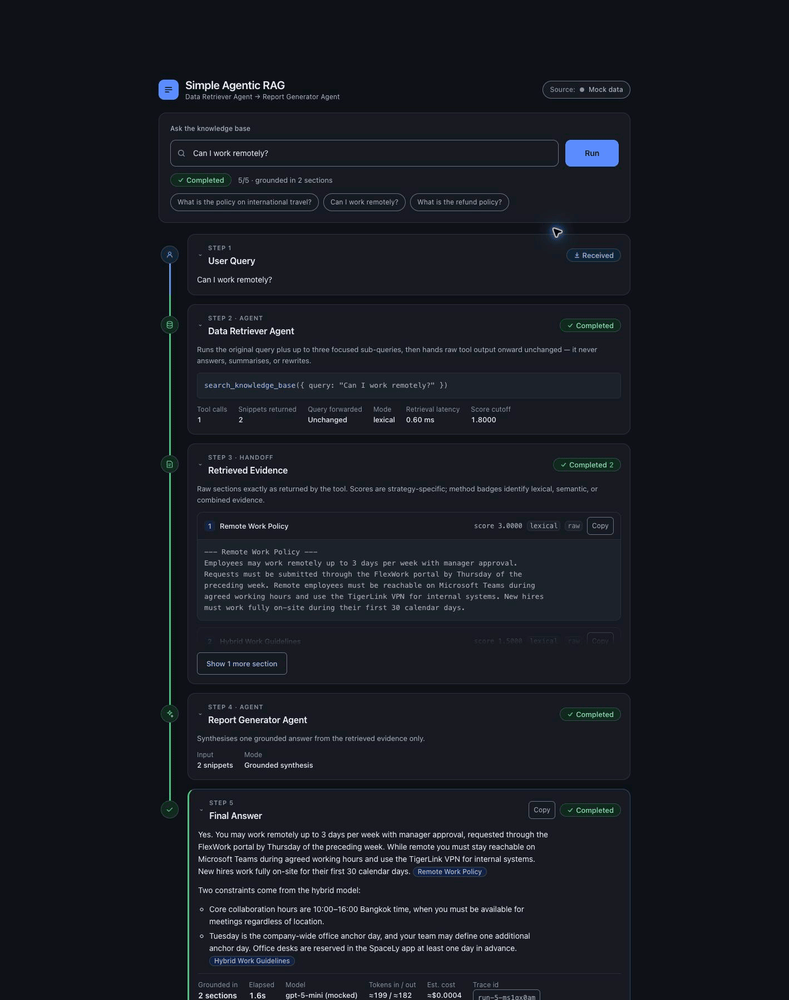 |

## Design decisions

**Why LangGraph.** The assignment evaluates orchestration, and LangGraph makes
the execution order and handoff contract inspectable. Each agent is a node,
each transition is an explicit edge, and `snippets` is a visible state field
rather than an implicit function-call detail.

**Why a forced retrieval tool call.** Binding the Retriever with
`tool_choice="required"` asks the model to use retrieval, while runtime
validation enforces 1–3 correctly named calls with non-empty queries. Only
the custom tool reads the knowledge base; the Retriever's model output is
not treated as evidence.

**Why the baseline union.** Letting the model decompose a mixed question
improves recall for multi-intent queries, but model behavior is
probabilistic. The node therefore always runs the original query itself
first and unions in the sub-query results — the handoff is provably a
superset of the deterministic single-search baseline, so a bad
decomposition can never lose recall, only add evidence.

**Why normalized weighted lexical retrieval is the default.** For a 10-section assignment
corpus, reviewed phrase/token aliases plus a light inflectional stemmer and
IDF-weighted title/body matching are easier to explain, audit, and test
than an embedding index. The relative relevance gate tolerates
natural-language filler without letting a broad one-term match overwhelm a
focused section. The thresholds, aliases, and stemmer rules are versioned
with the calibration set instead of being tuned from one example, and every
layer's contribution is measured in the ablation table above.

**Why semantic and hybrid remain optional.** Semantic search measurably
improves held-out recall and negative discipline for unseen language, but it
adds provider cost and roughly half a second of query-embedding latency.
Calibration also proves that relevant and near-miss cosine distributions
overlap. Hybrid uses gate-first RRF rather than combining incomparable raw
scores; it maximizes recall but cannot undo false positives admitted by
either side. Keeping lexical as the offline default makes those trade-offs
explicit instead of silently changing runtime behavior.

**Why Thai uses the existing two agents.** The original Thai query still runs
through the configured retriever as the deterministic baseline. The same Data
Retriever Agent then requests a faithful English translation sub-query because
the source document is English; no translator node, query-rewriter agent, or
conditional graph edge is added. The Report Generator writes the surrounding
prose in the user's language but preserves evidence numbers, currency codes,
names, and English citations. The fixed English not-found sentence is the
intentional exception: keeping it byte-exact preserves the deterministic
no-evidence guard and its measurable contract for every language.

**Why raw state handoff.** Keeping source sections unchanged makes it possible
to compare the Generator's input directly with `knowledge_base.txt`. This
separates retrieval quality from answer-generation quality.

**Why the LLM judge is evaluation-only.** Claim-level faithfulness and
relevance help investigate semantic defects that deterministic matching may
miss, but one model run is not a safe runtime authorization or release
decision. The judge remains outside LangGraph, receives only the query,
handed-off snippets, and final answer, and reports soft metrics with explicit
model/prompt provenance and independent `judge_error` handling.

**Why short-circuit empty evidence.** When `snippets` is empty, there is nothing
safe to synthesize. Returning a fixed sentence without an LLM call reduces
hallucination risk, latency, and API cost.

**Why failures are not converted to not-found.** A missing tool call, malformed
corpus, or empty model response means the pipeline failed; it does not prove
that the requested information is absent. These errors retain their original
cause internally, while the CLI emits a concise message without raw queries,
prompts, snippets, or credentials. Single-query mode exits non-zero, and
interactive mode continues with the next query.

**Why pinned dependencies.** Exact versions reduce installation drift in a
reviewer's Python 3.11 environment.

## Limitations and production next steps

This repository intentionally optimizes for clarity and assignment alignment,
not production scale.

- **Modes optimize different metrics:** lexical held-out exact match is
  57.1% and misses unseen paraphrases; semantic recovers examples such as
  "how fast do you reply" and reaches 90.9% held-out recall, but its exact
  match is 42.9% because related sections also pass the global threshold.
- **Inflectional stemming only:** the light stemmer covers
  `-s`/`-es`/`-ies`/`-ed`/`-ing` (held-out `unseen_inflection` cases pass),
  but derivational forms still need reviewed aliases, and stemming can
  bypass the surface-form generic-term filter — on the held-out set,
  `card processing rates` wrongly retrieves "…Process" sections because
  `processing` stems to the filtered word `process` after filtering.
- **Hard negatives leak:** the 12-case near-miss calibration set measures
  FP at 91.7% lexical, 41.7% semantic, and 91.7% hybrid. A zero-FP semantic
  threshold would reject all 38 measured positive pairs, so the selected
  F0.5 boundary deliberately accepts five difficult near-misses. Domain or
  metadata constraints would be required to separate cases such as domestic
  versus international travel.
- **Thai retrieval remains best-effort:** the 13-case Thai slice has only
  10.0% direct semantic recall and 20.0% hybrid recall at the threshold
  calibrated before the slice was measured. The LLM-generated English
  sub-query recovers verified examples through the full pipeline, but it is
  probabilistic, adds a model call, and may translate ambiguously. Lowering
  `MIN_COSINE` to flatter the Thai slice was deliberately rejected because it
  would weaken the measured hard-negative discipline.
- **Heuristic relevance gate:** the `1.5` title weight and `0.60` relative
  cutoff pass the 27-case calibration set but require recalibration against
  representative production traffic.
- **Small local corpus:** a linear scan is appropriate for 10 sections, not
  hundreds of thousands of documents.
- **Provider-bound semantic mode:** semantic and hybrid searches require
  approved data egress, an API key, provider quota, and roughly 0.5 seconds
  per query embedding in the recorded run. They fail loudly and never fall
  back silently to lexical.
- **Single-judge faithfulness:** invented citations still fail loudly at
  runtime, while the evaluation-only judge measures claim support and
  relevance. The result is one model's judgment from one run, not a
  deterministic runtime guard or a substitute for human-calibrated evals.
- **No service layer:** the pipeline runs in-process behind the CLI. There is no
  HTTP API, authentication, persistence, monitoring, or rate-limit handling.
- **Mock-first web UI:** because no service exists yet, the front end ships with
  offline fixtures. They reproduce the retrieval gate's decisions for the
  evaluated queries but do not execute the Python tool, so the UI is a
  demonstration of the workflow rather than a second implementation of it.
- **In-process telemetry handoff:** retrieval telemetry uses consume-on-read
  thread-local storage because LangChain's stable tool contract must remain
  `list[str]`. This isolates synchronous request workers, but an async service
  should replace it with request-scoped propagation and explicitly redacted,
  access-controlled telemetry before serving concurrent production traffic.

A production evolution would add document ingestion and lifecycle management,
a larger labeled retrieval dataset, hybrid lexical/vector retrieval, metadata
filters and access control, human-calibrated or multi-judge answer evaluation,
tracing, cost and latency monitoring, provider error handling, and a
deployable API layer.

## License

This project is available under the [MIT License](LICENSE).
