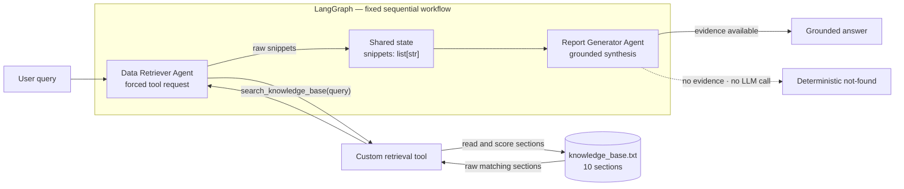

# Simple Agentic RAG

> An auditable two-agent RAG pipeline built with LangGraph and OpenAI.
> It retrieves raw evidence from a local knowledge base, hands that evidence
> between agents through typed shared state, and produces a grounded answer—or
> a deterministic not-found response when the knowledge base has no answer.


This repository is a deliberately small implementation of the
[AI Engineer Programming Test](<AI Engineer Programming Test.md>). It focuses
on the assignment's core engineering concerns: clear agent responsibilities, a
custom Retrieval-Augmented Generation (RAG) tool, explicit orchestration,
inspectable evidence handoff, grounded generation, and reproducible offline
tests.

## What the system does

A user asks a question about the fictional **Siam Innovate** knowledge base.
The system then:

1. sends the question to a **Data Retriever Agent**;
2. forces that agent to request the custom `search_knowledge_base` tool;
3. retrieves relevant sections from `knowledge_base.txt`;
4. passes the raw sections to a **Report Generator Agent** through LangGraph
   state; and
5. produces a concise answer based only on those sections.

The CLI displays the query, retrieved evidence, and final answer as separate
stages, making the RAG handoff easy to audit.

### Key properties

- **Two specialized agents:** retrieval and answer synthesis have separate
  responsibilities.
- **Custom local RAG tool:** retrieval reads a plain UTF-8 text file and needs
  no vector database.
- **Deterministic retrieval:** the same query and knowledge base produce the
  same ordered snippets.
- **Raw evidence handoff:** the Retriever does not summarize or rewrite the
  sections it returns.
- **Grounded generation:** the Generator is instructed to use only the
  retrieved evidence.
- **Fail-closed behavior:** empty retrieval returns an exact not-found sentence
  without calling the Generator LLM.
- **Offline test suite:** retrieval and orchestration tests require neither an
  API key nor network access.

## Architecture



The graph topology has no router, retry loop, or conditional retrieval path:

```text
START -> data_retriever -> report_generator -> END
```

Agent-to-agent handoff uses one explicit state contract:

```python
class PipelineState(TypedDict):
    query: str            # original user question
    snippets: list[str]   # Retriever output -> Generator input
    report: str           # final answer
```

### Agent responsibilities

#### 1. Data Retriever Agent

- binds only the `search_knowledge_base` tool;
- uses `tool_choice="required"` so the model must request a tool call;
- executes one requested retrieval call;
- writes the tool's unmodified `list[str]` result to `state["snippets"]`; and
- never produces the user-facing answer.

#### 2. Report Generator Agent

- receives only the user query and retrieved snippets;
- has no tools;
- combines complementary facts and removes repetition;
- is instructed not to add outside knowledge or assumptions; and
- short-circuits empty evidence to:

```text
I could not find this information in the knowledge base.
```

## Retrieval design

`knowledge_base.txt` contains 10 clearly delimited sections across workplace
policies, international travel, expenses, a payment product, and customer
support. Each section begins with a machine-readable heading:

```text
--- Section Title ---
Section content...
```

The custom tool in `src/tools/retrieval.py` follows a small, transparent
pipeline:

1. read `knowledge_base.txt` as UTF-8;
2. split the document at section headings;
3. normalize text with `re.findall(r"[a-z0-9]+", text.lower())`;
4. remove English stopwords and broad enterprise terms such as `policy`,
   `company`, `employee`, and `information`;
5. score each section by the number of distinct query terms covered by its
   title and body;
6. require a strict majority of the query terms to reject incidental one-word
   matches;
7. for a focused two-term query, retain sibling sections only when they share a
   title anchor with a full-coverage section;
8. sort by matched-term count and then original document order; and
9. return every section that passes the relevance rule—there is no fixed
   `TOP_K`.

This rule improves both precision and cross-section recall while remaining
fully deterministic:

| Query | Retrieved sections |
|---|---|
| `international travel` | Approval Process, Daily Allowance, Insurance |
| `international card fee` | PaySiam Gateway only |
| `international travel insurance coverage` | Travel Insurance only |
| `escalate a P1 outage` | Customer Support Levels + Support Escalation |
| `Can I work remotely?` | Remote Work + Hybrid Work |
| `What is the CEO's salary?` | No sections |

The tool returns source sections as raw text. It does not ask an LLM to search,
summarize, enrich, or rank the evidence.

## Technology stack

| Component | Technology | Purpose |
|---|---|---|
| Runtime | Python 3.11 | Application and tests |
| Orchestration | LangGraph | Fixed two-node workflow and shared state |
| Agent/tool primitives | LangChain Core | Messages, tool schema, and invocation |
| LLM integration | LangChain OpenAI | `ChatOpenAI` client and tool binding |
| Configuration | python-dotenv | Local environment configuration |
| Knowledge store | UTF-8 text file | Small, inspectable evidence source |
| Testing | `unittest` | Offline regression and graph tests |

## Project structure

```text
.
├── main.py                       # CLI: single-query and interactive modes
├── knowledge_base.txt            # 10-section local knowledge base
├── requirements.txt              # pinned Python dependencies
├── .env.example                  # safe configuration template
├── AI Engineer Programming Test.md
├── LICENSE
├── README.md
├── screenshots/
│   ├── 01_international_travel.png
│   ├── 02_remote_work.png
│   └── 03_not_found.png
├── src/
│   ├── config.py                 # model, temperature, and KB path
│   ├── graph.py                  # PipelineState and LangGraph wiring
│   ├── agents/
│   │   ├── __init__.py           # shared ChatOpenAI construction
│   │   ├── retriever.py          # Data Retriever node
│   │   └── reporter.py           # Report Generator node
│   └── tools/
│       └── retrieval.py          # parsing, scoring, and custom tool
└── tests/
    ├── test_retrieval.py         # retrieval precision/recall regressions
    └── test_graph.py             # agent behavior and graph handoff
```

## Quick start

The project has been verified on **Python 3.11** and requires a Standard OpenAI
API key for end-to-end queries.

```bash
git clone https://github.com/Sayomphon/Simple_Agentic_RAG.git
cd Simple_Agentic_RAG

python3.11 -m venv .venv
source .venv/bin/activate
python -m pip install -r requirements.txt

cp .env.example .env
```

On Windows, activate the environment with:

```powershell
.venv\Scripts\activate
```

Add your API key to `.env`:

```dotenv
OPENAI_API_KEY=your_api_key_here
MODEL_NAME=gpt-5-mini
TEMPERATURE=0
KB_PATH=knowledge_base.txt
```

| Variable | Required | Default | Description |
|---|---:|---|---|
| `OPENAI_API_KEY` | Yes | — | Standard OpenAI API credential |
| `MODEL_NAME` | No | `gpt-5-mini` | Chat model used by both agents |
| `TEMPERATURE` | No | `0` | Used for models that support a custom temperature |
| `KB_PATH` | No | `knowledge_base.txt` | Path to the local text knowledge base |

`.env` and virtual environments are ignored by Git. Never commit a real API
key.

## Run the application

### Single query

```bash
python main.py "What is the policy on international travel?"
```

### Interactive mode

```bash
python main.py
```

Enter an empty line, `exit`, `quit`, or press `Ctrl-C` to stop.

The CLI exposes all three observable stages:

```text
[1] USER QUERY
[2] RETRIEVED SNIPPETS (Data Retriever -> Report Generator)
[3] FINAL ANSWER
```

Suggested queries:

```text
What is the policy on international travel?
Can I work remotely?
What is the CEO's salary?
```

- The international-travel query retrieves three complementary sections.
- The remote-work query combines Remote Work and Hybrid Work.
- The CEO salary query retrieves nothing and returns the deterministic
  not-found sentence.

## Tests

Run the complete offline suite:

```bash
python -m unittest discover -v
```

The current suite contains **17 tests** covering:

- knowledge-base loading and section splitting;
- focused and unknown-query retrieval;
- stopword and generic-term false-positive protection;
- multi-term precision and stronger term-coverage rules;
- cross-section recall;
- title-linked sibling retrieval and its false-positive guard;
- complete relevant-section retrieval and deterministic ordering;
- forced tool execution and fail-closed behavior;
- raw-snippet handoff through LangGraph;
- exact two-node graph topology; and
- deterministic not-found behavior without a Generator LLM call.

The suite uses mocks at the LLM boundary, so it needs no API key and makes no
network requests.

## Example results

The screenshots below were captured from successful live CLI runs with
`gpt-5-mini`. Each image shows the user query, the raw evidence handoff, and the
final grounded answer.

### International travel — multi-section synthesis

The assignment's sample question retrieves Approval Process, Daily Allowance,
and Insurance sections before producing one cohesive answer.


### Remote work — related-section synthesis

The system combines Remote Work Policy and Hybrid Work Guidelines without
duplicating overlapping information.


### Knowledge-base gap — deterministic not-found

Executive salary information does not exist in the knowledge base, so the
system returns the fixed fallback instead of inventing an answer.


## Design decisions

**Why LangGraph.** The assignment evaluates orchestration, and LangGraph makes
the execution order and handoff contract inspectable. Each agent is a node,
each transition is an explicit edge, and `snippets` is a visible state field
rather than an implicit function-call detail.

**Why a forced retrieval tool call.** Binding the Retriever with
`tool_choice="required"` prevents it from replacing evidence retrieval with a
direct answer. Only the custom tool reads the knowledge base; the Retriever's
model output is not treated as evidence.

**Why deterministic lexical retrieval.** For a 10-section assignment corpus, a
transparent keyword rule is easier to explain, audit, and test than an
embedding index. Strict-majority coverage and the constrained sibling rule
reduce false positives while preserving complementary evidence.

**Why raw state handoff.** Keeping source sections unchanged makes it possible
to compare the Generator's input directly with `knowledge_base.txt`. This
separates retrieval quality from answer-generation quality.

**Why short-circuit empty evidence.** When `snippets` is empty, there is nothing
safe to synthesize. Returning a fixed sentence without an LLM call reduces
hallucination risk, latency, and API cost.

**Why pinned dependencies.** Exact versions reduce installation drift in a
reviewer's Python 3.11 environment.

## Limitations and production next steps

This repository intentionally optimizes for clarity and assignment alignment,
not production scale.

- **Lexical matching only:** synonyms and conceptual similarity are not
  understood.
- **No stemming:** variants such as `remote` and `remotely` remain different
  tokens unless both appear in a relevant section.
- **English query terms:** effective retrieval requires specific English terms
  present in the knowledge base.
- **Heuristic relevance gate:** strict-majority coverage is explainable but
  should be calibrated against a larger, representative query set.
- **Small local corpus:** a linear scan is appropriate for 10 sections, not
  hundreds of thousands of documents.
- **Prompt-level grounding:** the Generator is strongly instructed to use only
  snippets, but production systems should also evaluate claims and citations.
- **Single-process CLI:** there is no API service, authentication, persistence,
  monitoring, or rate-limit handling.

A production evolution would add document ingestion and lifecycle management,
hybrid lexical/vector retrieval, metadata filters and access control, a
retrieval evaluation dataset, answer faithfulness checks, tracing, cost and
latency monitoring, provider error handling, and a deployable API layer.

## License

This project is available under the [MIT License](LICENSE).
