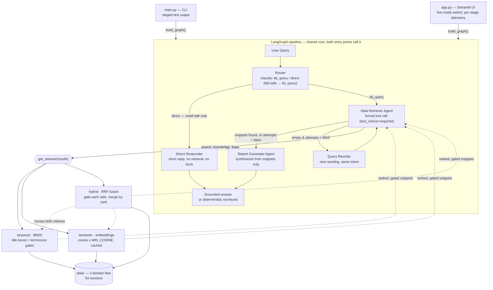
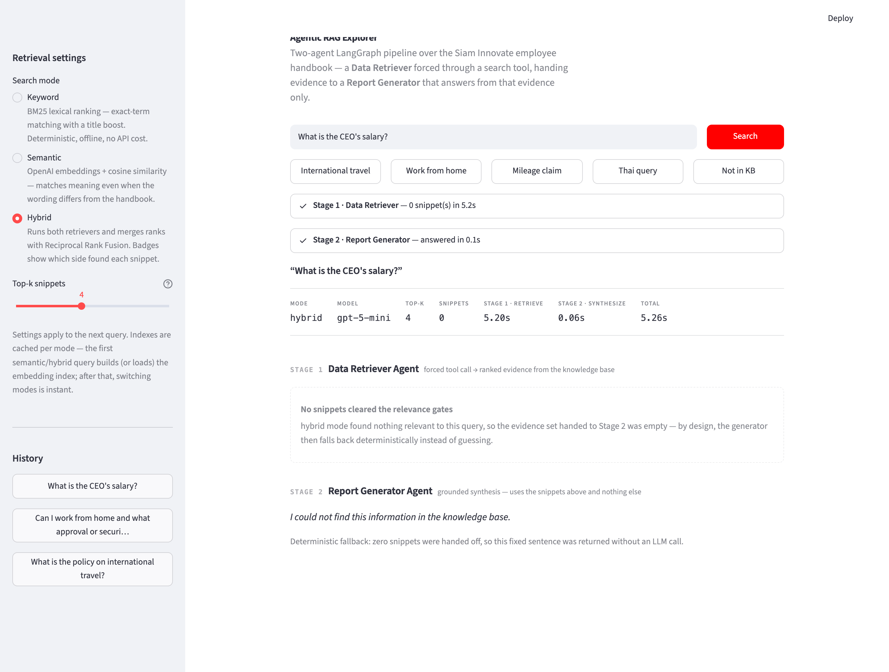
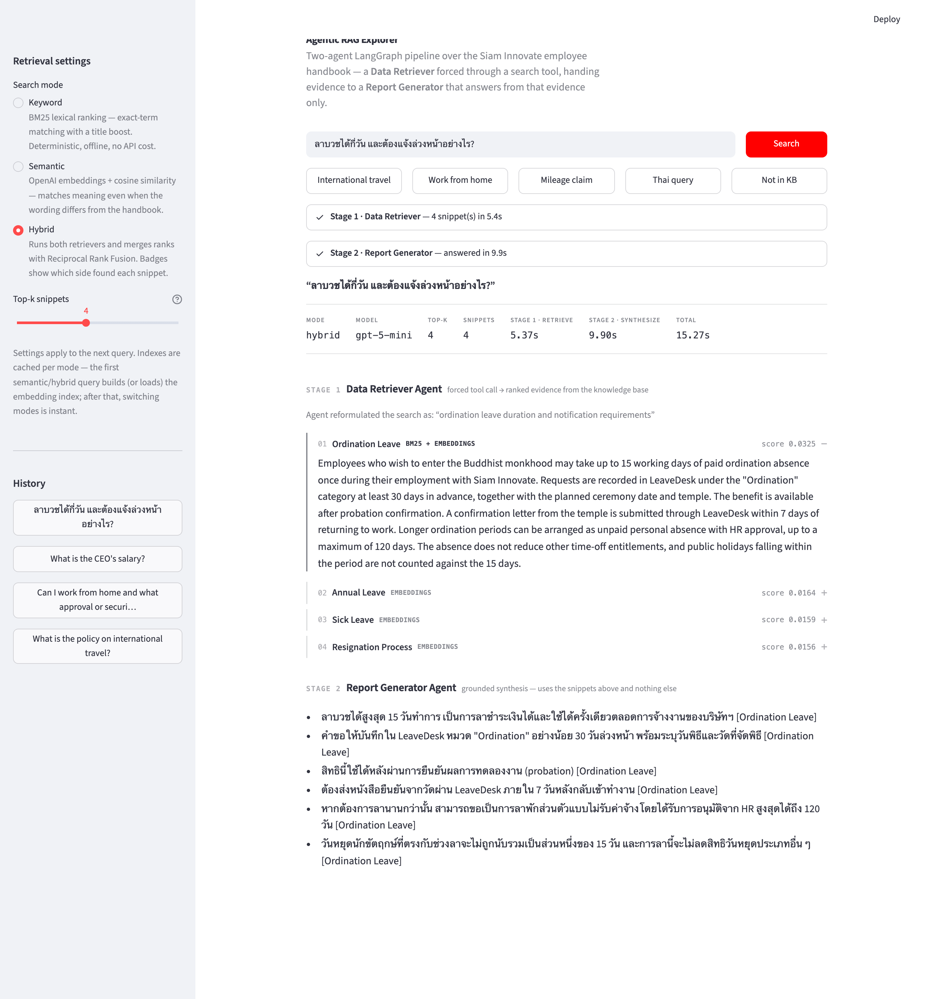
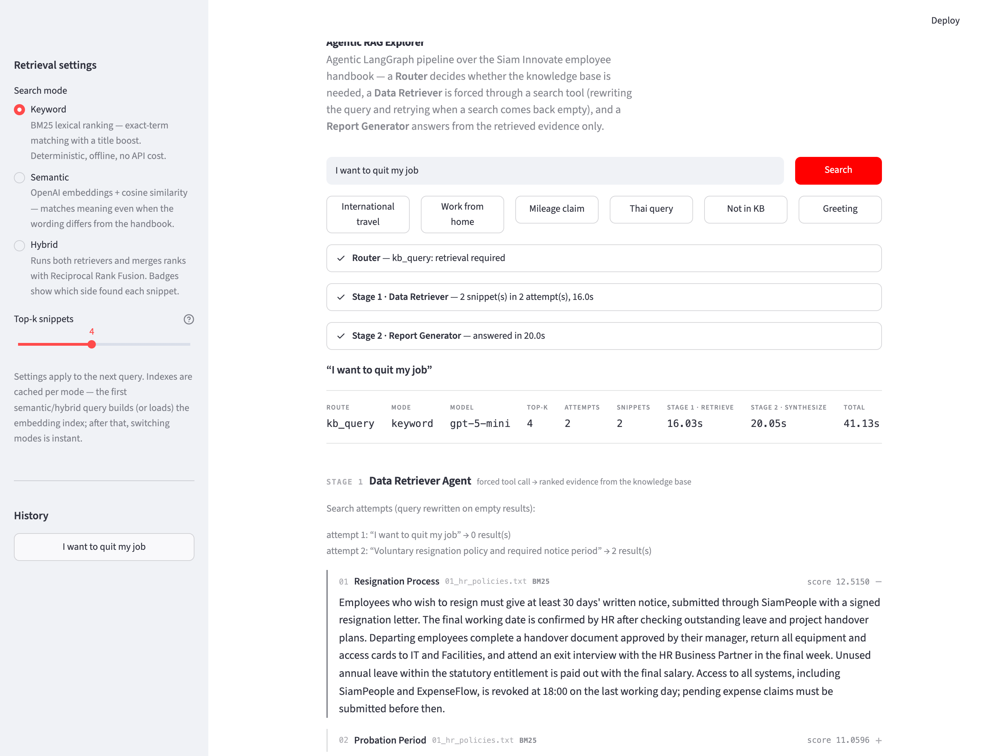
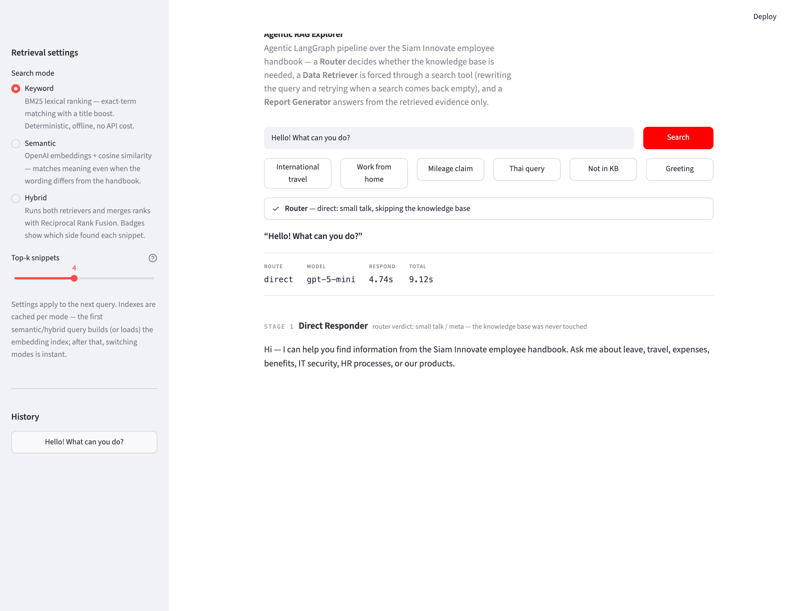

# Agentic RAG System (LangGraph + OpenAI)

An **agentic RAG pipeline** on LangGraph that makes three decisions per query:
a **Router** decides whether the question needs the knowledge base at all
(small talk never touches it); a **Data Retriever** — structurally forced
through a search tool — retrieves evidence, and when a search comes back empty
a **Query Rewriter** reformulates the query (same intent, different wording)
and retries, up to `MAX_SEARCH_ATTEMPTS`; a **Report Generator** synthesizes a
grounded answer from the retrieved snippets only, falling back to a
deterministic not-found sentence when nothing clears the relevance gates.
Retrieval runs in one of three modes — **keyword** (BM25), **semantic**
(embeddings), or **hybrid** (rank fusion of both) — behind one `Retriever`
protocol, so the agents, tool, and graph never change when the strategy does.
A CLI and a Streamlit UI drive the *same* compiled graph.

## Architecture



**Orchestration pattern — handoff through shared state, with conditional
edges.** The data flow is a `TypedDict` whose three required fields are the
core contract:

```python
class PipelineState(TypedDict):
    query: str            # user question (input)
    snippets: list[str]   # Data Retriever output -> handoff to the Generator
    report: str           # final answer (Generator or Direct Responder)
    # + NotRequired fields: route, search_attempts, rewritten_query,
    #   search_mode, top_k, search_query, hits
```

The graph is `START -> router -> (direct_responder | data_retriever)`; after
each retrieval attempt a conditional edge sends the state to the generator
(snippets found, or the attempt budget is spent) or to the rewriter, which
loops back to the retriever. Two properties are guaranteed structurally: the
loop is bounded (`search_attempts` grows on *every* pass, including the
fail-closed one, and the edge condition checks it against
`MAX_SEARCH_ATTEMPTS`), and retry attempts use the rewriter's query verbatim —
the retriever's own LLM call and its English-copy heuristic are bypassed, so a
rewrite can never be silently overridden back to the original wording.

## Project Structure

```
├── main.py                   # CLI entry point: staged output per query
├── app.py                    # Streamlit UI (presentation layer only)
├── data/                     # fictional company handbook (54 sections, 3 files)
│   ├── 01_hr_policies.txt          # HR, workplace, IT & office policies
│   ├── 02_travel_and_expenses.txt  # travel, expenses, procurement/vendors
│   └── 03_products_and_support.txt # products, support SLAs, service credits
├── requirements.txt          # pinned dependencies
├── evaluation_results.md     # generated by the eval harness (numbers below)
└── src/
    ├── config.py             # every tunable, each overridable via env var
    ├── graph.py              # PipelineState + StateGraph wiring
    ├── tools/retrieval.py    # search_knowledge_base tool + search_scored
    ├── retrievers/
    │   ├── base.py           # Chunk, ScoredChunk, Retriever protocol, load_chunks
    │   ├── keyword.py        # title-aware BM25 + lexical gates
    │   ├── dense.py          # OpenAI embeddings + content-addressed disk cache
    │   ├── hybrid.py         # RRF (and weighted) fusion over both sides
    │   └── factory.py        # get_retriever(mode): cached, lazy, keyword-fallback
    ├── agents/               # router, retriever, query rewriter, reporter nodes
    └── evaluation/           # regression suite + comparative benchmark + run_qa
```

## Setup & Run

Requires **Python 3.11+** and an OpenAI API key.

```bash
git clone https://github.com/Sayomphon/Agentic-RAG-Assistant.git
cd Agentic-RAG-Assistant
python3.11 -m venv venv && source venv/bin/activate   # Windows: venv\Scripts\activate
pip install -r requirements.txt
cp .env.example .env                                  # then put your OPENAI_API_KEY in .env
```

The retrieval mode is `SEARCH_MODE` in `.env` (default `keyword`); set it to
`semantic` or `hybrid` to use embeddings. **CLI** — single query or interactive:

```bash
python main.py "What is the policy on international travel?"
python main.py                    # interactive; empty line or 'exit' to quit
```

**Web UI** — same graph, with a live mode switch that overrides `SEARCH_MODE`
per query:

```bash
streamlit run app.py              # http://localhost:8501
```

**Retrieval-only checks** (no LLM; keyword mode needs no API key):

```bash
python -m src.tools.retrieval       # sanity check on sample queries
python -m src.evaluation.regression # exact-match regression suite (exit 1 on regression)
python -m src.evaluation.run_eval   # comparative benchmark, regenerates evaluation_results.md
python -m unittest discover -v
```

The two evaluation harnesses have deliberately distinct roles: the
**regression suite** (`regression.py`, 15 exact-match cases) pins the exact
section set every golden query must return in the default keyword mode and
runs inside `unittest`, so any retrieval change that silently reorders or
drops evidence fails CI-style; the **comparative benchmark** (`run_eval.py`,
a separate 15-query set with per-category metrics) measures all three modes
side by side to justify mode selection. One guards against going backwards;
the other measures which direction is forward.

## Sample Output

**End-to-end Q→A transcript:** [sample_qa_results.md](sample_qa_results.md)
runs 17 questions (the full 15-query golden set plus a Thai query and a
greeting) through the real pipeline in hybrid mode and records every decision
per question — the router's verdict, each search attempt with the rewritten
query, the evidence with scores and provenance, and the final answer verbatim.
Generated with `python -m src.evaluation.run_qa`.

Captured from `streamlit run app.py` in **hybrid** mode (except where a caption
notes otherwise). Each run shows the full pipeline in one view: the Data Retriever's ranked evidence with scores and
provenance badges (Stage 1), then the Report Generator's grounded answer
(Stage 2). Every claim in the answer ends with a citation to the section it
came from (e.g. `[Remote Work Policy]`), so each statement is traceable to the
evidence above it; the not-found fallback carries no citation.

**“What is the policy on international travel?”** — the assignment's example
query. All four travel sections are retrieved and merged into one structured
answer:


**“Can I work from home and what approval or security rules apply?”** —
multi-section synthesis across *Remote Work Policy*, *Hybrid Work Guidelines*,
and *IT Security and Password Policy*, deduplicated into one answer:


**“What is the CEO's salary?”** — the designed knowledge-base gap. The retry
loop spends its attempts (each rewrite still finds nothing relevant), and the
answer is the not-found sentence — byte-exact, as the answer-level eval
verifies on every run. (This screenshot predates the retry loop; the attempt
trail the current pipeline produces is shown two examples below.)



**“ลาบวชได้กี่วัน และต้องแจ้งล่วงหน้าอย่างไร?”** — a Thai query answered in Thai; the
retriever reformulates the search in English to match the handbook's wording:



**“I want to quit my job” (keyword mode)** — the retry loop in action. The
first search (the query verbatim) clears no gates, so the Query Rewriter
reformulates it as *“Voluntary resignation policy and required notice period”*
and the second attempt retrieves *Resignation Process* — recovering in keyword
mode a query that vocabulary mismatch would otherwise miss. The telemetry strip
records `attempts 2`, and Stage 1 shows the full attempt trail:



**“Hello! What can you do?”** — the Router short-circuits. Classified as small
talk, the query routes `direct`: the knowledge base is never searched (no Stage 1
retrieval, no snippets), and the Direct Responder returns a brief reply that
answers nothing factual — the telemetry strip shows `route direct`:



## Evaluation Results

`python -m src.evaluation.run_eval` scores all three modes on a 15-query golden
set (`src/evaluation/testset.py`) and writes `evaluation_results.md`. The set is
fixed *before* any mode runs — it is never edited to flatter a result. Numbers
below are from the run of **2026-07-25** (`TOP_K=4`, `MIN_COSINE=0.38`,
`FUSION_METHOD=rrf`, `RRF_K=60`, `text-embedding-3-small`).

`hit_rate@k`/`recall@k`/`MRR` average over the 13 answerable queries; `FP_rate`
is over the 2 negative queries (a false positive = any chunk returned for a
question the KB cannot answer). Latency is wall-clock per `search`, so semantic
and hybrid include the OpenAI query-embedding round-trip.

| mode     | hit_rate@k | recall@k | MRR   | FP_rate (neg) | avg latency |
|----------|------------|----------|-------|---------------|-------------|
| keyword  | 62%        | 54%      | 0.558 | 0%            | 0.1 ms      |
| semantic | 77%        | 71%      | 0.718 | 0%            | 431.4 ms    |
| hybrid   | **85%**    | **77%**  | **0.808** | 0%        | 429.4 ms    |

Per-category, the modes have distinct strengths — hybrid is best overall
precisely because it inherits both:

| category (n)      | metric   | keyword | semantic | hybrid |
|-------------------|----------|---------|----------|--------|
| lexical (4)       | hit_rate | **100%**| 75%      | **100%** |
| semantic (6)      | hit_rate | 17%     | **67%**  | **67%** |
| multi_chunk (3)   | hit_rate | 100%    | 100%     | 100%   |
| negative (2)      | FP_rate  | 0%      | 0%       | 0%     |

Keyword owns exact identifiers but collapses to **17%** when the user's wording
differs from the handbook's ("quit my job" vs *Resignation Process*); semantic
recovers those to **67%** at the cost of two lexical cases; hybrid keeps lexical
at **100%** *and* semantic at **67%**, so its overall hit rate (**85%**) beats
either side alone. Full tables and every imperfect case are in
[evaluation_results.md](evaluation_results.md).

### Answer-level evaluation

`python -m src.evaluation.run_answer_eval` scores the **final generated
answers** (not just retrieval) on four axes — two deterministic, two
LLM-as-judge. The judge sees only (query, snippets, answer), never a golden
answer, so no reference answers are maintained; the deterministic axes use no
LLM at all, so the two guarantees that matter most (citations point at real
evidence; negatives stay not-found) are immune to judge bias. Numbers from the
run of **2026-07-25** (hybrid mode, 17 questions):

| axis | method | result | threshold |
|---|---|---|---|
| citation validity | deterministic | **100%** — every `[Title]` cited names a section actually handed to the generator | 100% |
| negative discipline | deterministic | **100%** — both negative queries returned the not-found sentence byte-exactly | 100% |
| faithfulness | LLM judge | **0.985** — answers decomposed into claims, each checked against the snippets | ≥ 0.9 |
| answer relevance | LLM judge | **5.00** avg (1–5) | ≥ 4.0 |

Per-question detail and every judge-rejected claim (shown raw, not hidden) are
in [answer_eval_results.md](answer_eval_results.md). Limitations: the judge is
a single LLM (no ensemble), n is small, and judged axes inherit the judge's
strictness — e.g. both "unsupported claims" in the current run are framing
sentences ("Below is a checklist…"), not factual fabrications.

## Design Decisions

**Why LangGraph + shared-state handoff.** The assignment's core is
orchestration, and LangGraph makes it *inspectable*: agents are nodes,
execution order is an explicit edge list, and the agent-to-agent contract is a
typed state schema. Shared state makes the handoff a first-class object
(`snippets`) rather than an implicit call chain — and the agentic behaviours
are explicit conditional edges, not prompt-level hopes: the retry loop and the
router's branch are both plain Python functions over the state.

**Router fails safe toward retrieval.** Only an explicit `direct` verdict
skips the knowledge base; an ambiguous, malformed, or missing verdict takes
the retrieval path. The asymmetry is deliberate: the retrieval path ends in a
guarded not-found fallback, while the direct path has only a prompt between
the model and an unsourced answer — so misrouting small talk into retrieval
costs latency, but misrouting a factual question into the direct path could
cost groundedness. The direct responder is additionally forbidden from
answering factual questions at all.

**The retry loop trades latency for recall — and negatives pay the bill.**
Rewriting and retrying recovers queries that single-shot retrieval missed
("I want to quit my job" finds *Resignation Process* on attempt 2 even in
keyword mode), but a query the KB genuinely cannot answer now burns all
`MAX_SEARCH_ATTEMPTS` before reaching not-found (~2 extra LLM calls). That is
the intended direction of the trade: a slower "not found" is recoverable, a
fabricated answer is not. End-to-end sampling also exposed a subtler failure —
the rewriter once turned a request *for* data ("employee home addresses") into
a query *about* data-handling policy, surfacing sections that let the
generator answer with classification rules. The fix is layered: the rewriter
must preserve the request itself, not just the topic, and the generator treats
related-but-not-answering snippets as grounds for not-found; the answer-level
eval's byte-exact negative check now guards the regression.

**Retrieval guardrails, in layers.** The retriever binds its tool with
`tool_choice="required"` and executes only the first call, so the model
*cannot* answer from its own knowledge; the generator is prompted to use only
the snippets and to end every claim with a `[Section Title]` citation drawn
from the snippet headers; and when retrieval returns zero snippets the generator node
short-circuits to a fixed not-found sentence with **no LLM call**, guaranteeing
that fallback byte-for-byte.

**Why RRF, not weighted score fusion.** BM25 scores are unbounded and grow with
query length and term rarity; cosine similarity lives in `[-1, 1]`. The scales
are incomparable, so a weighted sum needs normalization first — and on a
54-chunk corpus, min-max normalization is *unstable*: min/max come from each
query's tiny candidate set, so one outlier rescales every other score. RRF uses
only each result's **rank** within its own list — scale-free, parameter-light
(`RRF_K=60`, the paper's default), and robust on small candidate sets. Weighted
fusion stays available (`FUSION_METHOD=weighted`) so the trade-off can be
measured, not assumed.

**Why gate at each retriever, before fusion.** Fusion must never *create*
relevance, and the two sides fail differently: BM25 returns nothing when no
query term matches, but **cosine similarity is never zero** — a dense search
always ranks *some* chunk highest, even for an unanswerable question. So each
side gates first (BM25's term/score floors; dense's `MIN_COSINE`), and hybrid
returns `[]` only when both do. One measured failure shaped the BM25 gate:
"What is the CEO's salary?" tokenized to a stray possessive fragment `s`
(indexed from 26/54 sections — "company's", "month's", …) that counted as a
second matched term and dragged *Parental Leave* past the gate at a score of
2.79; the fragment is now stopworded, so incidental single-word overlap can no
longer pass the matched-term gate. `MIN_COSINE=0.38` is set from measured data:
answerable queries scored ≥ 0.426 against their target section while the
strongest unanswerable query peaked at 0.369, so the gate sits just above that
ceiling. Without it, every negative query would surface its least-unrelated
chunk and invite a hallucination.

**The hybrid trade-off is real, and keyword is still the default.** Hybrid buys
+23 points of hit rate and recall over keyword (62%→85%, 54%→77%) and +0.25 MRR,
but latency jumps from **0.1 ms to ~416 ms** (an OpenAI round-trip per query
plus a batched index build), and it adds a second index, the fusion layer, a
disk cache, and a keyword-fallback path. So `SEARCH_MODE` defaults to `keyword` — sub-millisecond,
offline, no API cost, best on exact-identifier lookups; reach for
semantic/hybrid when vocabulary-mismatch recall is worth the latency and cost.

**Why the UI shows pipeline stages, not a chatbox.** A chat window would hide
the one thing this system exists to show — that the answer comes from an
agentic pipeline with inspectable decisions and an evidence hand-off. The
telemetry strip shows the router's verdict and the attempt count; **Stage 1**
renders every retrieved snippet with its rank, score, source file, and a
provenance badge (BM25 / embeddings / both under fusion), plus the full search-attempt
trail when the query was rewritten; **Stage 2** shows the grounded answer,
visually separated so it is clearly synthesized *from the evidence above*, and
surfaces the deterministic not-found fallback verbatim when retrieval is empty.
The sidebar switches mode and `top_k` per query — making the evaluation
comparison reproducible interactively — and per-stage telemetry accompanies
each run.
`app.py` is pure presentation: it calls the same `build_graph()` and
`get_retriever()` the CLI and tool layer use, cached with `st.cache_resource`.

## Knowledge Base Design

54 handbook sections for the fictional **Siam Innovate Co., Ltd.** (~100 words
each, split on `--- Section Title ---`), organized as three per-domain files
under `data/` — HR & workplace policies, travel & expenses, products & support.
Ingestion (`load_chunks`) reads the directory in sorted-filename order and
assigns each section a corpus-wide running index, so chunk identity stays
deterministic across files; each chunk also records its `source_file` as
provenance, which the UI displays alongside the section title. Three
properties are built in deliberately, and the golden set probes each:

1. **Cross-chunk synthesis** — international travel is split across four sections
   (Approval / Daily Allowance / Insurance / Visa Support), so a complete answer
   must merge multiple chunks.
2. **Overlap for de-duplication** — *Remote Work Policy* and *Hybrid Work
   Guidelines* restate the same limits; a correct summary states each fact once.
3. **A designed gap** — no section states executive salaries, so "What is the
   CEO's salary?" must end in the not-found fallback, not a hallucination.

Grounding is verifiable because the KB is packed with invented specifics no
model could know from pretraining — TravelHub, SafeJourney Plan B, a 2,400 THB
daily allowance, Form HR-204. When an answer contains these, retrieval is the
only possible source.

## Limitations & Next Steps

- **The BM25 score floor has little headroom against negatives.** The strongest
  observed negative candidate scored 2.79 ("CEO's salary" → *Parental Leave*),
  above `MIN_SCORE=2.0`; it is blocked today by the matched-term gate (the
  possessive fragment `s` no longer counts as a term), but a future negative
  matching two incidental content words would pass both gates. Raising the
  floor to ~3.0 adds margin at a measured cost: the lowest-scoring true
  positive (*Compensation Disbursement Schedule* at 2.31 for "When do I get
  paid each month?") would fall with it in keyword mode — hybrid keeps that
  hit via the dense side (cosine 0.47).
- **Semantic recall tops out at 67% on the hard category.** Ultra-terse queries
  fall below `MIN_COSINE` (e.g. "quit my job" scored 0.345 < 0.38) and degrade to
  not-found — a deliberate trade, but a query-length-aware gate or a cross-encoder
  re-ranker could recover some without raising false positives.
- **`MIN_COSINE` is a single global threshold** tuned to one embedding model and
  this corpus; changing either requires re-measuring the score gap.
- **`top_k=4` caps multi-chunk recall.** The overseas-trip case has four target
  sections but only four slots, and unrelated chunks sometimes take one.
- **Single-turn, in-memory index.** No conversation memory (a LangGraph
  checkpointer would add it without changing the shape). At 54 chunks a linear
  scan is ideal; at ~100k chunks this becomes offline batch embedding, an
  external vector store, and an ANN index.
- **Small evaluation set.** 15 golden queries protect known behaviours but are
  not statistically representative; production would add real anonymized
  queries, slice metrics, and drift monitoring.